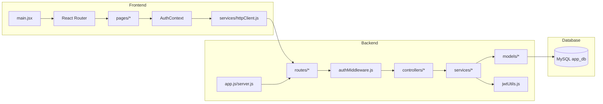
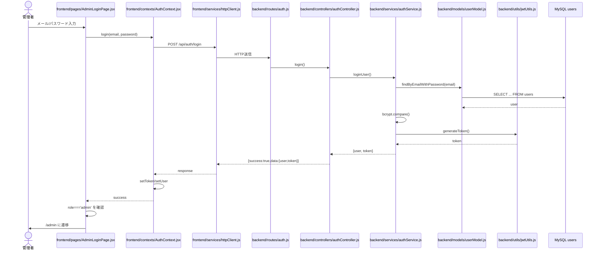
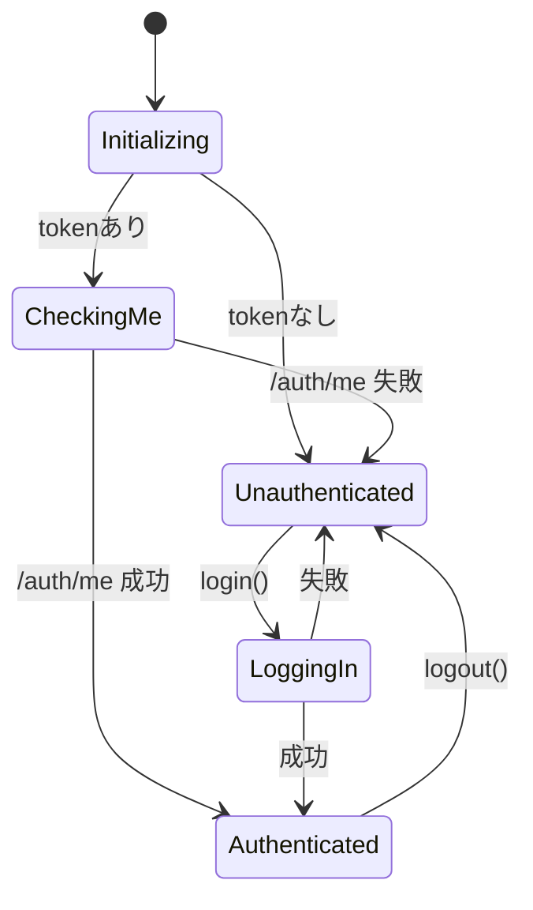
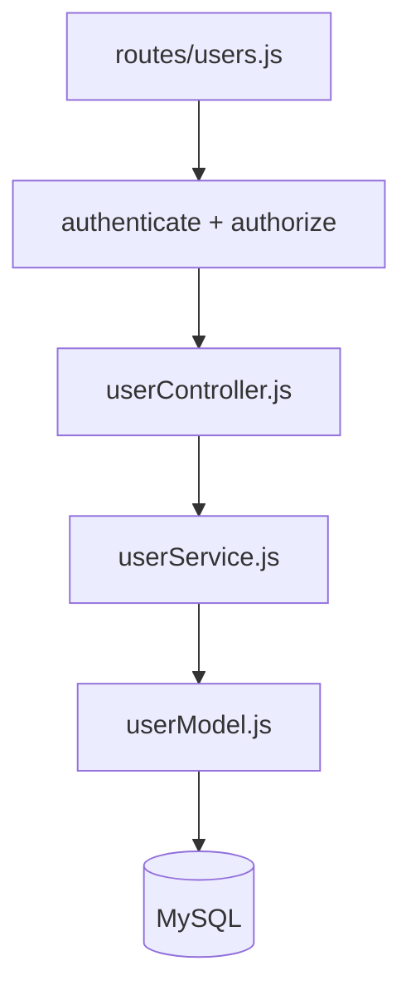
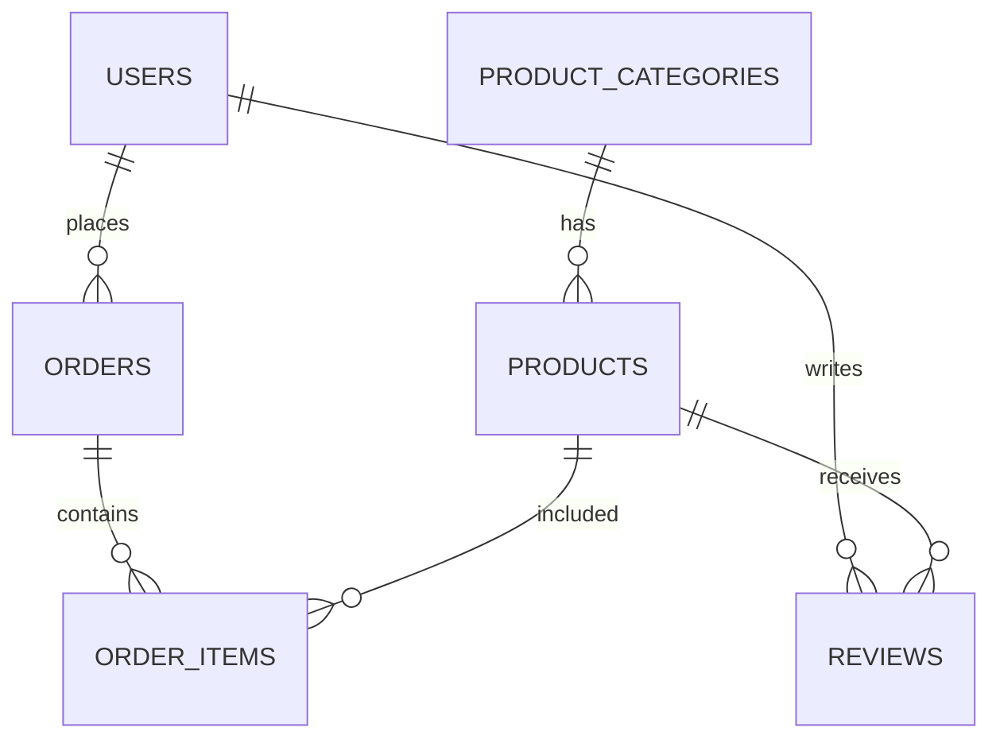

# SYSTEM DESIGN SPEC（やさしい図解版）

この設計書は「どのファイルが、どの順番で、何をしているか」を図で理解するための資料です。

---

## 1. 全体アーキテクチャ



---

## 2. 管理者ログインの流れ



---

## 3. フロントルーティング

```mermaid
graph TD
  ROOT[/ /] --> SEL[SelectRole]

  SEL --> ULOGIN[/mypage/login/]
  SEL --> ALOGIN[/admin/login/]

  ULOGIN --> MP[/mypage ProtectedRoute/]
  MP --> DASH[Dashboard]
  MP --> PROD[ProductList/ProductDetail]
  MP --> ORD[OrderList]

  ALOGIN --> ADM[/admin ProtectedRoute(requiredRole='admin')/]
  ADM --> USERS[UsersPage]
```

---

## 4. 認証状態（AuthContext）



---

## 5. Backend 責務分離（Controller/Service/Model）



### 役割
- Route: URL とミドルウェアの接続
- Controller: 入力確認・HTTPレスポンス
- Service: ビジネスロジック
- Model: SQL 実行

---

## 6. DB 主要テーブル関係



---

## 7. 重要ファイル早見表

- `frontend/src/main.jsx`: ルーティング定義
- `frontend/src/contexts/AuthContext.jsx`: ログイン状態の中心
- `frontend/src/services/httpClient.js`: token 自動付与
- `backend/src/routes/auth.js`: auth API 入口
- `backend/src/controllers/authController.js`: login/register/me/logout
- `backend/src/middlewares/authMiddleware.js`: 認証・認可
- `backend/src/services/authService.js`: bcrypt/JWT/ログイン実処理
- `backend/src/models/userModel.js`: users テーブル SQL

---

## 8. 実装時の注意

1. 認証ヘッダは `req.headers.authorization`
2. 管理者APIは `authorize("admin")` 必須
3. Frontend は API 結果を `response.data` で扱う
4. API 仕様は `success/data/error` を維持する
