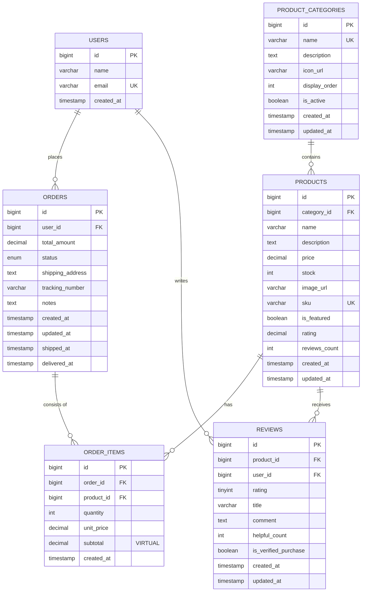

# エコマースプラットフォーム - ER図（Mermaid形式）

このファイルはMermaid形式でデータベースのEntity-Relationship Diagram（ER図）を定義しています。  
VS CodeのMermaid拡張機能で視覚化できます。

---

## Mermaid ER Diagram



---

## テーブル関係の説明

### 1️⃣ USERS テーブル

| カラム | 型 | 制約 | 説明 |
|--------|-----|------|------|
| `id` | BIGINT | PK | プライマリーキー |
| `name` | VARCHAR(100) | - | ユーザー名 |
| `email` | VARCHAR(255) | UQ | メールアドレス（ユニーク） |
| `created_at` | TIMESTAMP | - | 作成日時 |

**関係性:**
- 1人のユーザーは複数の**注文**を持つ（1:多）
- 1人のユーザーは複数の**レビュー**を投稿（1:多）

---

### 2️⃣ PRODUCT_CATEGORIES テーブル

| カラム | 型 | 制約 | 説明 |
|--------|-----|------|------|
| `id` | BIGINT | PK | プライマリーキー |
| `name` | VARCHAR(100) | UQ | カテゴリー名 |
| `description` | TEXT | - | 詳細説明 |
| `icon_url` | VARCHAR(500) | - | アイコン画像URL |
| `display_order` | INT | - | 表示順序 |
| `is_active` | BOOLEAN | - | アクティブフラグ |
| `created_at` | TIMESTAMP | - | 作成日時 |
| `updated_at` | TIMESTAMP | - | 更新日時 |

**関係性:**
- 1つのカテゴリーは複数の**製品**を含む（1:多）

---

### 3️⃣ PRODUCTS テーブル

| カラム | 型 | 制約 | 説明 |
|--------|-----|------|------|
| `id` | BIGINT | PK | プライマリーキー |
| `category_id` | BIGINT | FK | カテゴリーへの外部キー |
| `name` | VARCHAR(200) | - | 製品名 |
| `description` | TEXT | - | 詳細説明 |
| `price` | DECIMAL(10,2) | - | 価格 |
| `stock` | INT | - | 在庫数 |
| `image_url` | VARCHAR(500) | - | 製品画像URL |
| `sku` | VARCHAR(100) | UQ | 商品コード |
| `is_featured` | BOOLEAN | - | 特集フラグ |
| `rating` | DECIMAL(3,2) | - | 平均レーティング |
| `reviews_count` | INT | - | レビュー数 |
| `created_at` | TIMESTAMP | - | 作成日時 |
| `updated_at` | TIMESTAMP | - | 更新日時 |

**関係性:**
- 複数の**製品**は1つのカテゴリーに属する（多:1）
- 1つの製品は複数の**注文アイテム**に含まれる（1:多）
- 1つの製品は複数の**レビュー**を受け取る（1:多）

---

### 4️⃣ ORDERS テーブル

| カラム | 型 | 制約 | 説明 |
|--------|-----|------|------|
| `id` | BIGINT | PK | プライマリーキー |
| `user_id` | BIGINT | FK | ユーザーへの外部キー |
| `total_amount` | DECIMAL(10,2) | - | 注文合計金額 |
| `status` | ENUM | - | 注文ステータス |
| `shipping_address` | TEXT | - | 配送先住所 |
| `tracking_number` | VARCHAR(100) | - | 追跡番号 |
| `notes` | TEXT | - | 備考 |
| `created_at` | TIMESTAMP | - | 作成日時 |
| `updated_at` | TIMESTAMP | - | 更新日時 |
| `shipped_at` | TIMESTAMP | - | 発送日時 |
| `delivered_at` | TIMESTAMP | - | 配達日時 |

**関係性:**
- 複数の**注文**は1人のユーザーに属する（多:1）
- 1つの注文は複数の**注文アイテム**で構成される（1:多）

---

### 5️⃣ ORDER_ITEMS テーブル（中間テーブル）

| カラム | 型 | 制約 | 説明 |
|--------|-----|------|------|
| `id` | BIGINT | PK | プライマリーキー |
| `order_id` | BIGINT | FK | 注文への外部キー |
| `product_id` | BIGINT | FK | 製品への外部キー |
| `quantity` | INT | - | 数量 |
| `unit_price` | DECIMAL(10,2) | - | 注文時の単価 |
| `subtotal` | DECIMAL(10,2) | VIRTUAL | 小計（自動計算） |
| `created_at` | TIMESTAMP | - | 作成日時 |

**役割:**
- **多対多関係**を解決する中間テーブル
- ORDERS ↔ PRODUCTS の関係を仲介
- 1つの注文に複数の製品が含まれることを表現

**関係性:**
- 複数の**注文アイテム**は1つの注文に属する（多:1）
- 複数の**注文アイテム**は1つの製品を参照（多:1）

---

### 6️⃣ REVIEWS テーブル

| カラム | 型 | 制約 | 説明 |
|--------|-----|------|------|
| `id` | BIGINT | PK | プライマリーキー |
| `product_id` | BIGINT | FK | 製品への外部キー |
| `user_id` | BIGINT | FK | ユーザーへの外部キー |
| `rating` | TINYINT | CHECK | 評価（1-5） |
| `title` | VARCHAR(200) | - | レビュータイトル |
| `comment` | TEXT | - | レビュー本文 |
| `helpful_count` | INT | - | 役立ち投票数 |
| `is_verified_purchase` | BOOLEAN | - | 購入者フラグ |
| `created_at` | TIMESTAMP | - | 投稿日時 |
| `updated_at` | TIMESTAMP | - | 更新日時 |

**関係性:**
- 複数の**レビュー**は1つの製品に関連する（多:1）
- 複数の**レビュー**は1人のユーザーが投稿（多:1）

---

## 外部キー制約一覧

| 子テーブル | カラム | 親テーブル | 親カラム | アクション |
|-----------|--------|-----------|--------|----------|
| `products` | `category_id` | `product_categories` | `id` | RESTRICT |
| `orders` | `user_id` | `users` | `id` | CASCADE |
| `order_items` | `order_id` | `orders` | `id` | CASCADE |
| `order_items` | `product_id` | `products` | `id` | RESTRICT |
| `reviews` | `product_id` | `products` | `id` | CASCADE |
| `reviews` | `user_id` | `users` | `id` | CASCADE |

### DELETE アクションの意味

- **CASCADE**: 親レコード削除時、関連する子レコードも自動削除
- **RESTRICT**: 親レコードに関連する子レコードがあれば削除を拒否

---

## Mermaid形式での記号説明

```
ONE: — または o—
MANY: o{ または ||

例: A ||--o{ B : "関係"
→ 1つのAは複数のBを持つ（1対多）

→ の後ろは関係性の説明（オプション）
```

---

## 使用方法

### 方法1: Mermaid Preview 拡張（推奨）

1. VS Code で本ファイル（`ER_DIAGRAM.md`）を開く
2. Mermaid Preview 拡張がインストール済みの場合、自動的にプレビューが表示される
3. `Ctrl + Shift + V` でマークダウンプレビューを開く
4. Mermaid図が描画される

### 方法2: Mermaid Live Editor

1. [Mermaid Live Editor](https://mermaid.live) にアクセス
2. 上記のMermaidコードをコピーして貼り付け
3. 右側にER図がリアルタイムで表示される

### 方法3: VS Code 拡張機能（複数選択肢あり）

**推奨順:**
1. **Mermaid Chart** (ID: `mermaidchart.vscode-mermaid-chart`)
   - 公式EditorのVS Code版
   - AI対応
   - 最も新しい機能が反映される

2. **Mermaid Preview** (ID: `vstirbu.vscode-mermaid-preview`)
   - 軽量で動作が速い
   - Mermaid.js公式メンテナンス
   - 十分な機能で推奨

3. **Mermaid Graphical Editor** (ID: `corschenzi.mermaid-graphical-editor`)
   - GUI エディタで図を編集可能
   - テキスト編集だけでなく、ドラッグ&ドロップで関係を追加できる

---

## 図の特徴

✅ **全テーブルを可視化**
- 6つのテーブルすべてが含まれる
- プライマリーキー（PK）、外部キー（FK）、ユニークキー（UK）が明記されている

✅ **関係性が明確**
- 1対多（1:多）関係が矢印で表現される
- 中間テーブル（ORDER_ITEMS）が正確に配置される

✅ **カラム情報が充実**
- 各テーブルの全カラムを表示
- データ型も記載

✅ **メンテナンス性が高い**
- テキスト形式なのでバージョン管理が容易
- テーブル追加時にコードを編集するだけで更新可能

---

## トラブルシューティング

### Q: Mermaid図が描画されない

**A:** 以下を確認してください：
1. VS Code MermaidPreview拡張がインストール済みか
2. マークダウンプレビュー（Ctrl + Shift + V）を開いているか
3. Mermaidコードは `` ```mermaid `` で囲まれているか

### Q: ER図が複雑に見える

**A:** Mermaid Live Editorで看板の調整ができます：
- ズーム: マウスホイール
- パン：ドラッグで移動
- ダウンロード：SVG/PNGで保存

### Q: 新しいテーブルを追加したい

**A:** 本ファイルのMermaidコードブロックに以下を追加：
```
    NEW_TABLE {
        bigint id PK
        varchar name
        ...
    }
    
    EXISTING_TABLE ||--o{ NEW_TABLE : "relates to"
```

---

## 参考リンク

- [Mermaid公式ドキュメント - ER Diagrams](https://mermaid.js.org/syntax/entityRelationshipDiagram.html)
- [Mermaid Live Editor](https://mermaid.live)
- [VS Code Mermaid拡張](https://marketplace.visualstudio.com/items?itemName=vstirbu.vscode-mermaid-preview)
