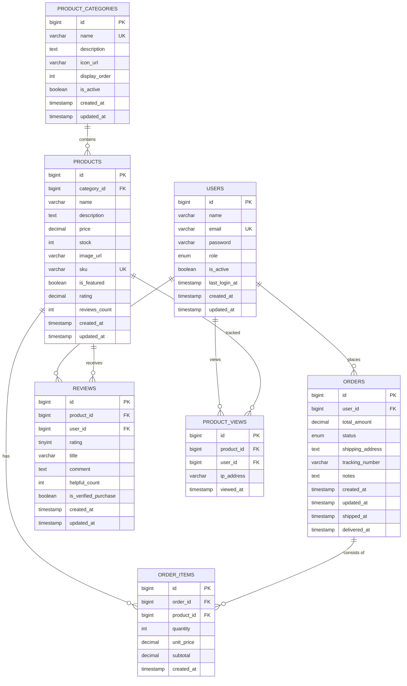

# データベース完全構築ガイド

> **目的:** MySQL データベースを0から構築し、Eコマースプラットフォームに必要な全テーブルを実装する

---

## 📋 目次

1. [概要](#概要)
2. [環境構築](#環境構築)
3. [ディレクトリ構成](#ディレクトリ構成)
4. [ER図](#er図)
5. [テーブル設計](#テーブル設計)
6. [マイグレーション実装](#マイグレーション実装)
7. [認証システム対応](#認証システム対応)
8. [改善機能](#改善機能)
9. [シードデータ](#シードデータ)
10. [運用コマンド](#運用コマンド)
11. [トラブルシューティング](#トラブルシューティング)

---

## 概要

### 最終的なデータベース構成

```
restapi_db (データベース)
├── users                    # ユーザーテーブル（認証対応）
├── product_categories       # 製品カテゴリー
├── products                 # 製品（FULLTEXT検索対応）
├── orders                   # 注文
├── order_items              # 注文明細
├── reviews                  # レビュー
└── product_views            # 製品閲覧履歴（人気製品用）
```

### 実装フェーズ

| フェーズ | 内容 | テーブル |
|---------|------|----------|
| Phase 1 | ユーザー管理 | `users` |
| Phase 2 | 製品・カテゴリー管理 | `product_categories`, `products` |
| Phase 3 | 注文・レビュー管理 | `orders`, `order_items`, `reviews` |
| Phase 4 | 認証システム | `users`（カラム追加） |
| Phase 5 | 改善機能 | `product_views`、インデックス最適化 |

---

## 環境構築

### 前提条件

- Docker Desktop がインストール済み
- ターミナル操作ができる

### ディレクトリ作成

```bash
# プロジェクトルートに移動
cd /Users/haytakeda/Sites/RESTAPI

# dbディレクトリ構成を作成
mkdir -p db/{init,schema,migrations,seeds}
```

### 環境変数ファイル

**ファイル:** `db/.env`

```bash
MYSQL_ROOT_PASSWORD=root_password
MYSQL_DATABASE=app_db
MYSQL_USER=app
MYSQL_PASSWORD=app_password
MYSQL_PORT=3306
```

### Docker Compose 設定

**ファイル:** `db/docker-compose.yml`

```yaml
services:
  db:
    image: mysql:8.0
    container_name: restapi-db
    env_file:
      - .env
    ports:
      - "${MYSQL_PORT}:3306"
    volumes:
      - db_data:/var/lib/mysql
      - ./init:/docker-entrypoint-initdb.d
    command:
      - --character-set-server=utf8mb4
      - --collation-server=utf8mb4_unicode_ci
      - --ngram_token_size=2
    healthcheck:
      test: ["CMD-SHELL", "mysqladmin ping -h 127.0.0.1 -u ${MYSQL_USER} -p${MYSQL_PASSWORD}"]
      interval: 10s
      timeout: 5s
      retries: 5

volumes:
  db_data:
```

**ポイント:**
- `ngram_token_size=2`: 日本語FULLTEXT検索を有効化
- `utf8mb4`: 日本語・絵文字対応
- `healthcheck`: 起動完了を検知

### 起動コマンド

```bash
# dbディレクトリに移動
cd db

# バックグラウンドで起動
docker compose up -d

# ログ確認
docker compose logs -f

# 接続テスト
mysql -h 127.0.0.1 -u app -papp_password -P 3306 app_db
```

---

## ディレクトリ構成

```
db/
├── .env                         # 環境変数
├── docker-compose.yml           # Docker設定
├── init/                        # 初期化SQL（初回起動時に1回だけ実行）
│   └── 00_init.sql
├── schema/                      # スキーマ定義（設計の参照用）
│   └── 001_users.sql
├── migrations/                  # マイグレーションファイル（時系列で適用）
│   ├── 001_create_users.sql
│   ├── 002_create_product_tables.sql
│   ├── 003_create_orders_reviews.sql
│   ├── 004_add_auth_to_users.sql
│   ├── 005_create_product_views.sql
│   └── 006_optimize_indexes.sql
├── seeds/                       # シードデータ（開発用テストデータ）
│   ├── 001_users.sql
│   ├── 002_product_categories.sql
│   ├── 003_products.sql
│   ├── 004_orders.sql
│   ├── 005_order_items.sql
│   ├── 006_reviews.sql
│   └── 007_auth_users.sql
├── README.md
└── ER_DIAGRAM.md
```

### 各ディレクトリの役割

| ディレクトリ | 目的 | 実行タイミング |
|-------------|------|---------------|
| `init/` | 初回起動時の設定（権限付与など） | コンテナ初回起動時に自動 |
| `schema/` | 設計の参照用（実行しない） | レビュー・共有用 |
| `migrations/` | テーブル作成・変更の履歴 | 手動で順番に適用 |
| `seeds/` | 開発用テストデータ | 手動で適用 |

---

## ER図

### Mermaid形式



### テーブル関係性

| 関係 | 説明 |
|------|------|
| USERS → ORDERS | 1人のユーザーは複数の注文を持つ（1:N） |
| USERS → REVIEWS | 1人のユーザーは複数のレビューを投稿（1:N） |
| USERS → PRODUCT_VIEWS | 1人のユーザーは複数の閲覧履歴を持つ（1:N） |
| PRODUCT_CATEGORIES → PRODUCTS | 1つのカテゴリーは複数の製品を含む（1:N） |
| PRODUCTS → ORDER_ITEMS | 1つの製品は複数の注文に含まれる（1:N） |
| PRODUCTS → REVIEWS | 1つの製品は複数のレビューを受け取る（1:N） |
| ORDERS → ORDER_ITEMS | 1つの注文は複数のアイテムを含む（1:N） |

---

## テーブル設計

### 1. users テーブル

```sql
CREATE TABLE users (
    id BIGINT UNSIGNED AUTO_INCREMENT PRIMARY KEY,
    name VARCHAR(100) NOT NULL,
    email VARCHAR(255) UNIQUE NOT NULL,
    password VARCHAR(255) DEFAULT NULL COMMENT 'bcryptハッシュ',
    role ENUM('user', 'admin') NOT NULL DEFAULT 'user',
    is_active BOOLEAN NOT NULL DEFAULT TRUE,
    last_login_at TIMESTAMP NULL DEFAULT NULL,
    created_at TIMESTAMP DEFAULT CURRENT_TIMESTAMP,
    updated_at TIMESTAMP DEFAULT CURRENT_TIMESTAMP ON UPDATE CURRENT_TIMESTAMP,
    
    INDEX idx_users_email (email),
    INDEX idx_users_role (role),
    INDEX idx_users_is_active (is_active)
) ENGINE=InnoDB DEFAULT CHARSET=utf8mb4 COLLATE=utf8mb4_unicode_ci;
```

| カラム | 型 | 説明 |
|--------|-----|------|
| `id` | BIGINT UNSIGNED | プライマリーキー |
| `name` | VARCHAR(100) | ユーザー名 |
| `email` | VARCHAR(255) | メールアドレス（ユニーク） |
| `password` | VARCHAR(255) | bcryptハッシュ化パスワード |
| `role` | ENUM | `user` or `admin` |
| `is_active` | BOOLEAN | アカウント有効フラグ |
| `last_login_at` | TIMESTAMP | 最終ログイン日時 |

### 2. product_categories テーブル

```sql
CREATE TABLE product_categories (
    id BIGINT UNSIGNED AUTO_INCREMENT PRIMARY KEY,
    name VARCHAR(100) NOT NULL UNIQUE,
    description TEXT,
    icon_url VARCHAR(500),
    display_order INT DEFAULT 0,
    is_active BOOLEAN DEFAULT TRUE,
    created_at TIMESTAMP DEFAULT CURRENT_TIMESTAMP,
    updated_at TIMESTAMP DEFAULT CURRENT_TIMESTAMP ON UPDATE CURRENT_TIMESTAMP,
    
    INDEX idx_name (name),
    INDEX idx_is_active (is_active)
) ENGINE=InnoDB DEFAULT CHARSET=utf8mb4 COLLATE=utf8mb4_unicode_ci;
```

| カラム | 型 | 説明 |
|--------|-----|------|
| `name` | VARCHAR(100) | カテゴリー名（ユニーク） |
| `display_order` | INT | 表示順序 |
| `is_active` | BOOLEAN | 有効フラグ |

### 3. products テーブル

```sql
CREATE TABLE products (
    id BIGINT UNSIGNED AUTO_INCREMENT PRIMARY KEY,
    category_id BIGINT UNSIGNED NOT NULL,
    name VARCHAR(200) NOT NULL,
    description TEXT,
    price DECIMAL(10, 2) NOT NULL,
    stock INT UNSIGNED NOT NULL DEFAULT 0,
    image_url VARCHAR(500),
    sku VARCHAR(100) UNIQUE,
    is_featured BOOLEAN DEFAULT FALSE,
    rating DECIMAL(3, 2) DEFAULT 0.00,
    reviews_count INT UNSIGNED DEFAULT 0,
    created_at TIMESTAMP DEFAULT CURRENT_TIMESTAMP,
    updated_at TIMESTAMP DEFAULT CURRENT_TIMESTAMP ON UPDATE CURRENT_TIMESTAMP,
    
    FOREIGN KEY (category_id) REFERENCES product_categories(id) ON DELETE RESTRICT,
    INDEX idx_category_id (category_id),
    INDEX idx_price (price),
    INDEX idx_is_featured (is_featured),
    INDEX idx_rating (rating),
    FULLTEXT INDEX idx_fulltext_search (name, description) WITH PARSER ngram
) ENGINE=InnoDB DEFAULT CHARSET=utf8mb4 COLLATE=utf8mb4_unicode_ci;
```

| カラム | 型 | 説明 |
|--------|-----|------|
| `category_id` | BIGINT UNSIGNED | カテゴリーFK |
| `price` | DECIMAL(10,2) | 価格 |
| `stock` | INT UNSIGNED | 在庫数 |
| `sku` | VARCHAR(100) | 商品コード（ユニーク） |
| `is_featured` | BOOLEAN | 特集フラグ |
| `rating` | DECIMAL(3,2) | 平均評価 |

**FULLTEXT検索:** `WITH PARSER ngram` で日本語検索に対応

### 4. orders テーブル

```sql
CREATE TABLE orders (
    id BIGINT UNSIGNED AUTO_INCREMENT PRIMARY KEY,
    user_id BIGINT UNSIGNED NOT NULL,
    total_amount DECIMAL(10, 2) NOT NULL,
    status ENUM('pending', 'processing', 'shipped', 'delivered', 'cancelled') DEFAULT 'pending',
    shipping_address TEXT,
    tracking_number VARCHAR(100),
    notes TEXT,
    created_at TIMESTAMP DEFAULT CURRENT_TIMESTAMP,
    updated_at TIMESTAMP DEFAULT CURRENT_TIMESTAMP ON UPDATE CURRENT_TIMESTAMP,
    shipped_at TIMESTAMP NULL,
    delivered_at TIMESTAMP NULL,
    
    FOREIGN KEY (user_id) REFERENCES users(id) ON DELETE CASCADE,
    INDEX idx_user_id (user_id),
    INDEX idx_status (status),
    INDEX idx_created_at (created_at)
) ENGINE=InnoDB DEFAULT CHARSET=utf8mb4 COLLATE=utf8mb4_unicode_ci;
```

**ステータス値:**
- `pending`: 注文受け取り
- `processing`: 処理中
- `shipped`: 発送済み
- `delivered`: 配達完了
- `cancelled`: キャンセル

### 5. order_items テーブル

```sql
CREATE TABLE order_items (
    id BIGINT UNSIGNED AUTO_INCREMENT PRIMARY KEY,
    order_id BIGINT UNSIGNED NOT NULL,
    product_id BIGINT UNSIGNED NOT NULL,
    quantity INT UNSIGNED NOT NULL DEFAULT 1,
    unit_price DECIMAL(10, 2) NOT NULL,
    subtotal DECIMAL(10, 2) GENERATED ALWAYS AS (quantity * unit_price) STORED,
    created_at TIMESTAMP DEFAULT CURRENT_TIMESTAMP,
    
    FOREIGN KEY (order_id) REFERENCES orders(id) ON DELETE CASCADE,
    FOREIGN KEY (product_id) REFERENCES products(id) ON DELETE RESTRICT,
    INDEX idx_order_id (order_id),
    INDEX idx_product_id (product_id)
) ENGINE=InnoDB DEFAULT CHARSET=utf8mb4 COLLATE=utf8mb4_unicode_ci;
```

**ポイント:** `subtotal` は `GENERATED ALWAYS AS` で自動計算

### 6. reviews テーブル

```sql
CREATE TABLE reviews (
    id BIGINT UNSIGNED AUTO_INCREMENT PRIMARY KEY,
    product_id BIGINT UNSIGNED NOT NULL,
    user_id BIGINT UNSIGNED NOT NULL,
    rating TINYINT UNSIGNED NOT NULL CHECK (rating BETWEEN 1 AND 5),
    title VARCHAR(200),
    comment TEXT,
    helpful_count INT UNSIGNED DEFAULT 0,
    is_verified_purchase BOOLEAN DEFAULT FALSE,
    created_at TIMESTAMP DEFAULT CURRENT_TIMESTAMP,
    updated_at TIMESTAMP DEFAULT CURRENT_TIMESTAMP ON UPDATE CURRENT_TIMESTAMP,
    
    FOREIGN KEY (product_id) REFERENCES products(id) ON DELETE CASCADE,
    FOREIGN KEY (user_id) REFERENCES users(id) ON DELETE CASCADE,
    INDEX idx_product_id (product_id),
    INDEX idx_user_id (user_id),
    INDEX idx_rating (rating),
    UNIQUE KEY uk_user_product (user_id, product_id)
) ENGINE=InnoDB DEFAULT CHARSET=utf8mb4 COLLATE=utf8mb4_unicode_ci;
```

**制約:** `uk_user_product` で1ユーザー1製品1レビューを保証

### 7. product_views テーブル

```sql
CREATE TABLE product_views (
    id BIGINT UNSIGNED AUTO_INCREMENT PRIMARY KEY,
    product_id BIGINT UNSIGNED NOT NULL,
    user_id BIGINT UNSIGNED DEFAULT NULL,
    ip_address VARCHAR(45) DEFAULT NULL COMMENT 'IPv6対応',
    viewed_at TIMESTAMP NOT NULL DEFAULT CURRENT_TIMESTAMP,
    
    FOREIGN KEY (product_id) REFERENCES products(id) ON DELETE CASCADE,
    FOREIGN KEY (user_id) REFERENCES users(id) ON DELETE SET NULL,
    INDEX idx_product_id (product_id),
    INDEX idx_user_id (user_id),
    INDEX idx_viewed_at (viewed_at),
    INDEX idx_product_viewed (product_id, viewed_at)
) ENGINE=InnoDB DEFAULT CHARSET=utf8mb4 COLLATE=utf8mb4_unicode_ci
COMMENT='製品閲覧履歴テーブル';
```

**用途:** 人気製品ランキングの集計に使用

---

## マイグレーション実装

### ファイル一覧

| 順番 | ファイル名 | 説明 |
|------|-----------|------|
| 001 | `001_create_users.sql` | usersテーブル作成 |
| 002 | `002_create_product_tables.sql` | カテゴリー・製品テーブル |
| 003 | `003_create_orders_reviews.sql` | 注文・レビューテーブル |
| 004 | `004_add_auth_to_users.sql` | 認証カラム追加 |
| 005 | `005_create_product_views.sql` | 閲覧履歴テーブル |
| 006 | `006_optimize_indexes.sql` | インデックス最適化 |

### 001_create_users.sql

**ファイル:** `db/migrations/001_create_users.sql`

```sql
BEGIN;

CREATE TABLE users (
    id BIGINT UNSIGNED AUTO_INCREMENT PRIMARY KEY,
    name VARCHAR(100) NOT NULL,
    email VARCHAR(255) UNIQUE NOT NULL,
    created_at TIMESTAMP DEFAULT CURRENT_TIMESTAMP
) ENGINE=InnoDB DEFAULT CHARSET=utf8mb4 COLLATE=utf8mb4_unicode_ci;

COMMIT;
```

### 002_create_product_tables.sql

**ファイル:** `db/migrations/002_create_product_tables.sql`

```sql
SET NAMES utf8mb4;

BEGIN;

-- カテゴリーテーブル
CREATE TABLE product_categories (
    id BIGINT UNSIGNED AUTO_INCREMENT PRIMARY KEY,
    name VARCHAR(100) NOT NULL UNIQUE,
    description TEXT,
    icon_url VARCHAR(500),
    display_order INT DEFAULT 0,
    is_active BOOLEAN DEFAULT TRUE,
    created_at TIMESTAMP DEFAULT CURRENT_TIMESTAMP,
    updated_at TIMESTAMP DEFAULT CURRENT_TIMESTAMP ON UPDATE CURRENT_TIMESTAMP,
    
    INDEX idx_name (name),
    INDEX idx_is_active (is_active)
) ENGINE=InnoDB DEFAULT CHARSET=utf8mb4 COLLATE=utf8mb4_unicode_ci;

-- 製品テーブル
CREATE TABLE products (
    id BIGINT UNSIGNED AUTO_INCREMENT PRIMARY KEY,
    category_id BIGINT UNSIGNED NOT NULL,
    name VARCHAR(200) NOT NULL,
    description TEXT,
    price DECIMAL(10, 2) NOT NULL,
    stock INT UNSIGNED NOT NULL DEFAULT 0,
    image_url VARCHAR(500),
    sku VARCHAR(100) UNIQUE,
    is_featured BOOLEAN DEFAULT FALSE,
    rating DECIMAL(3, 2) DEFAULT 0.00,
    reviews_count INT UNSIGNED DEFAULT 0,
    created_at TIMESTAMP DEFAULT CURRENT_TIMESTAMP,
    updated_at TIMESTAMP DEFAULT CURRENT_TIMESTAMP ON UPDATE CURRENT_TIMESTAMP,
    
    FOREIGN KEY (category_id) REFERENCES product_categories(id) ON DELETE RESTRICT,
    INDEX idx_category_id (category_id),
    INDEX idx_price (price),
    INDEX idx_is_featured (is_featured),
    FULLTEXT INDEX idx_fulltext_search (name, description) WITH PARSER ngram
) ENGINE=InnoDB DEFAULT CHARSET=utf8mb4 COLLATE=utf8mb4_unicode_ci;

COMMIT;
```

### 003_create_orders_reviews.sql

**ファイル:** `db/migrations/003_create_orders_reviews.sql`

```sql
SET NAMES utf8mb4;

BEGIN;

-- 注文テーブル
CREATE TABLE orders (
    id BIGINT UNSIGNED AUTO_INCREMENT PRIMARY KEY,
    user_id BIGINT UNSIGNED NOT NULL,
    total_amount DECIMAL(10, 2) NOT NULL,
    status ENUM('pending', 'processing', 'shipped', 'delivered', 'cancelled') DEFAULT 'pending',
    shipping_address TEXT,
    tracking_number VARCHAR(100),
    notes TEXT,
    created_at TIMESTAMP DEFAULT CURRENT_TIMESTAMP,
    updated_at TIMESTAMP DEFAULT CURRENT_TIMESTAMP ON UPDATE CURRENT_TIMESTAMP,
    shipped_at TIMESTAMP NULL,
    delivered_at TIMESTAMP NULL,
    
    FOREIGN KEY (user_id) REFERENCES users(id) ON DELETE CASCADE,
    INDEX idx_user_id (user_id),
    INDEX idx_status (status),
    INDEX idx_created_at (created_at)
) ENGINE=InnoDB DEFAULT CHARSET=utf8mb4 COLLATE=utf8mb4_unicode_ci;

-- 注文明細テーブル
CREATE TABLE order_items (
    id BIGINT UNSIGNED AUTO_INCREMENT PRIMARY KEY,
    order_id BIGINT UNSIGNED NOT NULL,
    product_id BIGINT UNSIGNED NOT NULL,
    quantity INT UNSIGNED NOT NULL DEFAULT 1,
    unit_price DECIMAL(10, 2) NOT NULL,
    subtotal DECIMAL(10, 2) GENERATED ALWAYS AS (quantity * unit_price) STORED,
    created_at TIMESTAMP DEFAULT CURRENT_TIMESTAMP,
    
    FOREIGN KEY (order_id) REFERENCES orders(id) ON DELETE CASCADE,
    FOREIGN KEY (product_id) REFERENCES products(id) ON DELETE RESTRICT,
    INDEX idx_order_id (order_id),
    INDEX idx_product_id (product_id)
) ENGINE=InnoDB DEFAULT CHARSET=utf8mb4 COLLATE=utf8mb4_unicode_ci;

-- レビューテーブル
CREATE TABLE reviews (
    id BIGINT UNSIGNED AUTO_INCREMENT PRIMARY KEY,
    product_id BIGINT UNSIGNED NOT NULL,
    user_id BIGINT UNSIGNED NOT NULL,
    rating TINYINT UNSIGNED NOT NULL CHECK (rating BETWEEN 1 AND 5),
    title VARCHAR(200),
    comment TEXT,
    helpful_count INT UNSIGNED DEFAULT 0,
    is_verified_purchase BOOLEAN DEFAULT FALSE,
    created_at TIMESTAMP DEFAULT CURRENT_TIMESTAMP,
    updated_at TIMESTAMP DEFAULT CURRENT_TIMESTAMP ON UPDATE CURRENT_TIMESTAMP,
    
    FOREIGN KEY (product_id) REFERENCES products(id) ON DELETE CASCADE,
    FOREIGN KEY (user_id) REFERENCES users(id) ON DELETE CASCADE,
    INDEX idx_product_id (product_id),
    INDEX idx_user_id (user_id),
    INDEX idx_rating (rating),
    UNIQUE KEY uk_user_product (user_id, product_id)
) ENGINE=InnoDB DEFAULT CHARSET=utf8mb4 COLLATE=utf8mb4_unicode_ci;

COMMIT;
```

### 004_add_auth_to_users.sql

**ファイル:** `db/migrations/004_add_auth_to_users.sql`

```sql
SET NAMES utf8mb4;

BEGIN;

-- パスワードカラム追加
ALTER TABLE users
ADD COLUMN password VARCHAR(255) DEFAULT NULL COMMENT 'bcryptハッシュ' AFTER email;

-- 役割カラム追加
ALTER TABLE users
ADD COLUMN role ENUM('user', 'admin') NOT NULL DEFAULT 'user' AFTER password;

-- アカウント有効状態
ALTER TABLE users
ADD COLUMN is_active BOOLEAN NOT NULL DEFAULT TRUE AFTER role;

-- 最終ログイン日時
ALTER TABLE users
ADD COLUMN last_login_at TIMESTAMP NULL DEFAULT NULL AFTER is_active;

-- 更新日時
ALTER TABLE users
ADD COLUMN updated_at TIMESTAMP DEFAULT CURRENT_TIMESTAMP ON UPDATE CURRENT_TIMESTAMP AFTER last_login_at;

-- インデックス追加
CREATE INDEX idx_users_email ON users(email);
CREATE INDEX idx_users_role ON users(role);
CREATE INDEX idx_users_is_active ON users(is_active);

COMMIT;
```

### 005_create_product_views.sql

**ファイル:** `db/migrations/005_create_product_views.sql`

```sql
SET NAMES utf8mb4;

BEGIN;

CREATE TABLE IF NOT EXISTS product_views (
    id BIGINT UNSIGNED AUTO_INCREMENT PRIMARY KEY,
    product_id BIGINT UNSIGNED NOT NULL,
    user_id BIGINT UNSIGNED DEFAULT NULL,
    ip_address VARCHAR(45) DEFAULT NULL COMMENT 'IPv6対応',
    viewed_at TIMESTAMP NOT NULL DEFAULT CURRENT_TIMESTAMP,
    
    FOREIGN KEY (product_id) REFERENCES products(id) ON DELETE CASCADE,
    FOREIGN KEY (user_id) REFERENCES users(id) ON DELETE SET NULL,
    INDEX idx_product_id (product_id),
    INDEX idx_user_id (user_id),
    INDEX idx_viewed_at (viewed_at),
    INDEX idx_product_viewed (product_id, viewed_at)
) ENGINE=InnoDB DEFAULT CHARSET=utf8mb4 COLLATE=utf8mb4_unicode_ci
COMMENT='製品閲覧履歴テーブル';

COMMIT;
```

### 006_optimize_indexes.sql

**ファイル:** `db/migrations/006_optimize_indexes.sql`

```sql
SET NAMES utf8mb4;

BEGIN;

-- ratingカラムにインデックス追加
ALTER TABLE products
  ADD INDEX idx_rating (rating)
  COMMENT '評価順ソートの高速化';

-- created_atカラムにインデックス追加（存在しない場合のみ）
-- 事前に SHOW INDEX FROM products; で確認してください
-- ALTER TABLE products
--   ADD INDEX idx_created_at (created_at);

COMMIT;
```

---

## 認証システム対応

### 設計方針

| カラム | 説明 | セキュリティ |
|--------|------|-------------|
| `password` | bcrypt（コスト10）でハッシュ化 | 平文保存禁止 |
| `role` | `user` / `admin` | ENUMで不正値を防止 |
| `is_active` | アカウント有効フラグ | FALSE = ログイン拒否 |

### パスワードハッシュ例

```
平文: password123
ハッシュ: $2b$10$EixZaYVK1fsbw1ZfbX3OXePaWxn96p36ZVZ5vX5H0IeZLG.9zAG4O
```

### 認証シードデータ

**ファイル:** `db/seeds/007_auth_users.sql`

```sql
SET NAMES utf8mb4;

BEGIN;

-- テスト用管理者アカウント
INSERT INTO users (name, email, password, role, is_active, created_at) VALUES
('管理者', 'admin@example.com', '$2b$10$EixZaYVK1fsbw1ZfbX3OXePaWxn96p36ZVZ5vX5H0IeZLG.9zAG4O', 'admin', TRUE, NOW())
ON DUPLICATE KEY UPDATE password = VALUES(password), role = VALUES(role);

-- テスト用エンドユーザーアカウント
INSERT INTO users (name, email, password, role, is_active, created_at) VALUES
('山田花子', 'hanako@example.com', '$2b$10$EixZaYVK1fsbw1ZfbX3OXePaWxn96p36ZVZ5vX5H0IeZLG.9zAG4O', 'user', TRUE, NOW()),
('佐藤次郎', 'jiro@example.com', '$2b$10$EixZaYVK1fsbw1ZfbX3OXePaWxn96p36ZVZ5vX5H0IeZLG.9zAG4O', 'user', TRUE, NOW())
ON DUPLICATE KEY UPDATE password = VALUES(password);

COMMIT;

-- テストアカウント情報
-- 管理者: admin@example.com / password123
-- ユーザー: hanako@example.com / password123
```

---

## 改善機能

### 人気製品ランキングのクエリ

```sql
-- 過去30日間の閲覧数で人気製品を取得
SELECT
  p.id, p.name, p.price, p.rating,
  COUNT(pv.id) as view_count
FROM products p
LEFT JOIN product_views pv ON p.id = pv.product_id
  AND pv.viewed_at >= DATE_SUB(NOW(), INTERVAL 30 DAY)
GROUP BY p.id
ORDER BY view_count DESC, p.rating DESC
LIMIT 10;
```

### FULLTEXT検索（日本語対応）

```sql
-- ngramパーサーによる日本語検索
SELECT * FROM products
WHERE MATCH(name, description) AGAINST('スマートフォン' IN BOOLEAN MODE);

-- 複数キーワード検索
SELECT * FROM products
WHERE MATCH(name, description) AGAINST('+iPhone +Pro' IN BOOLEAN MODE);
```

### インデックス確認コマンド

```sql
-- 製品テーブルのインデックス一覧
SHOW INDEX FROM products;

-- クエリの実行計画確認
EXPLAIN SELECT * FROM products WHERE rating > 4.0 ORDER BY created_at DESC;
```

---

## シードデータ

### 002_product_categories.sql

```sql
INSERT INTO product_categories (name, description, display_order, is_active) VALUES
('エレクトロニクス', 'スマートフォン、タブレット、PC周辺機器', 1, TRUE),
('ファッション', '衣類、靴、アクセサリー', 2, TRUE),
('ホーム&キッチン', '家電、調理器具、インテリア', 3, TRUE),
('書籍', '本、雑誌、電子書籍', 4, TRUE),
('スポーツ', 'スポーツ用品、アウトドア', 5, TRUE);
```

### 003_products.sql

```sql
INSERT INTO products (category_id, name, description, price, stock, is_featured, rating, reviews_count) VALUES
(1, 'iPhone 15 Pro', '最新のA17 Proチップ搭載、チタニウムデザイン', 150000.00, 50, TRUE, 4.80, 125),
(1, 'MacBook Air M3', '超軽量ノートPC、最大18時間バッテリー', 180000.00, 30, TRUE, 4.75, 89),
(1, 'AirPods Pro 2', 'アクティブノイズキャンセリング搭載', 39800.00, 100, FALSE, 4.60, 342),
(2, 'プレミアムレザージャケット', '本革使用、撥水加工済み', 45000.00, 20, FALSE, 4.20, 28),
(3, '多機能電気圧力鍋', '時短調理に最適、8種類の調理モード', 15800.00, 45, TRUE, 4.50, 156);
```

---

## 運用コマンド

### マイグレーション実行

```bash
# 全マイグレーションを順番に実行
cd /Users/haytakeda/Sites/RESTAPI

docker exec -i restapi-db mysql -u app -papp_password app_db < db/migrations/001_create_users.sql
docker exec -i restapi-db mysql -u app -papp_password app_db < db/migrations/002_create_product_tables.sql
docker exec -i restapi-db mysql -u app -papp_password app_db < db/migrations/003_create_orders_reviews.sql
docker exec -i restapi-db mysql -u app -papp_password app_db < db/migrations/004_add_auth_to_users.sql
docker exec -i restapi-db mysql -u app -papp_password app_db < db/migrations/005_create_product_views.sql
docker exec -i restapi-db mysql -u app -papp_password app_db < db/migrations/006_optimize_indexes.sql
```

### シード実行

```bash
docker exec -i restapi-db mysql -u app -papp_password app_db < db/seeds/001_users.sql
docker exec -i restapi-db mysql -u app -papp_password app_db < db/seeds/002_product_categories.sql
docker exec -i restapi-db mysql -u app -papp_password app_db < db/seeds/003_products.sql
docker exec -i restapi-db mysql -u app -papp_password app_db < db/seeds/007_auth_users.sql
```

### 確認コマンド

```bash
# テーブル一覧
docker exec -i restapi-db mysql -u app -papp_password app_db -e "SHOW TABLES;"

# テーブル構造確認
docker exec -i restapi-db mysql -u app -papp_password app_db -e "DESCRIBE users;"
docker exec -i restapi-db mysql -u app -papp_password app_db -e "DESCRIBE products;"

# データ確認
docker exec -i restapi-db mysql -u app -papp_password app_db -e "SELECT id, name, email, role FROM users;"
```

---

## トラブルシューティング

### コンテナが起動しない

```bash
# ログ確認
docker compose -f db/docker-compose.yml logs

# ボリューム削除してやり直し
docker compose -f db/docker-compose.yml down -v
docker compose -f db/docker-compose.yml up -d
```

### 接続できない

```bash
# コンテナの状態確認
docker ps

# ヘルスチェック確認
docker inspect restapi-db --format='{{.State.Health.Status}}'

# ポート確認
lsof -i :3306
```

### 外部キーエラー

```sql
-- 外部キー制約を一時的に無効化
SET FOREIGN_KEY_CHECKS = 0;
-- SQL実行
SET FOREIGN_KEY_CHECKS = 1;
```

### 文字化け

```sql
-- 文字コード確認
SHOW VARIABLES LIKE 'character_set%';
SHOW VARIABLES LIKE 'collation%';

-- テーブルの文字コード変更
ALTER TABLE products CONVERT TO CHARACTER SET utf8mb4 COLLATE utf8mb4_unicode_ci;
```

---

## 学習ポイント

### なぜ ALTER TABLE を使うのか

```sql
-- 既存データを保持しながらカラム追加
ALTER TABLE users ADD COLUMN password VARCHAR(255);

-- DROP TABLE → CREATE TABLEだと既存データが消える
```

### なぜインデックスが必要か

- **WHERE句**: `WHERE email = ?` → `idx_users_email`
- **ORDER BY句**: `ORDER BY rating DESC` → `idx_rating`
- **JOIN条件**: `JOIN ... ON p.category_id = c.id` → `idx_category_id`

### なぜ外部キー制約を使うか

```sql
FOREIGN KEY (category_id) REFERENCES product_categories(id) ON DELETE RESTRICT
```

- **データ整合性保証**: 存在しないカテゴリーIDを指定できない
- **CASCADE/RESTRICT**: 親レコード削除時の動作を制御

---

**このガイドに従って実装することで、Eコマースプラットフォームに必要な全てのデータベース機能を構築できます。**
