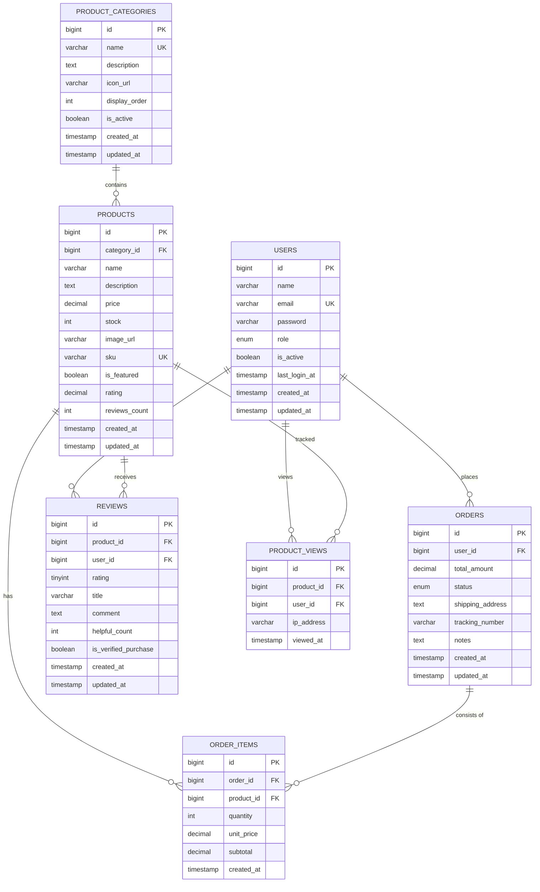

# データベース構築ガイド【完全版】

> **対象:** IT初学者  
> **目標:** Eコマースアプリケーションのデータベースを0から構築する  
> **所要時間:** 約2〜3時間  
> **前提:** Docker Desktop がインストール済みであること

---

## 目次

1. [このガイドで構築するもの](#1-このガイドで構築するもの)
2. [データベースの基礎知識](#2-データベースの基礎知識)
3. [Phase 1: 環境構築とユーザーテーブル](#3-phase-1-環境構築とユーザーテーブル)
4. [Phase 2: 製品・カテゴリーテーブル](#4-phase-2-製品カテゴリーテーブル)
5. [Phase 3: 注文・レビューテーブル](#5-phase-3-注文レビューテーブル)
6. [Phase 4: 認証システム用カラム追加](#6-phase-4-認証システム用カラム追加)
7. [Phase 5: 閲覧履歴テーブルとパフォーマンス最適化](#7-phase-5-閲覧履歴テーブルとパフォーマンス最適化)
8. [シードデータ（テスト用初期データ）](#8-シードデータテスト用初期データ)
9. [ER図（テーブル関係図）](#9-er図テーブル関係図)
10. [検証方法](#10-検証方法)
11. [トラブルシューティング](#11-トラブルシューティング)

---

## 1. このガイドで構築するもの

### 完成イメージ

6つのテーブルで構成される本格的なEコマースデータベースを構築します。

```
┌─────────────────────────────────────────────────────────────────┐
│                     app_db データベース                          │
│                                                                 │
│  users (ユーザー) ─── orders (注文) ─── order_items (注文明細)  │
│       │                                        │                │
│       │                                   products (製品)       │
│       │                                        │                │
│       └─── reviews (レビュー) ────────────────┘                │
│                                                │                │
│                                   product_categories (カテゴリ) │
└─────────────────────────────────────────────────────────────────┘
```

### 構築フェーズ

| フェーズ | 内容 | 作成するテーブル |
|---------|------|---------------|
| Phase 1 | ユーザー管理 | `users` |
| Phase 2 | 製品管理 | `product_categories`, `products` |
| Phase 3 | 注文・レビュー | `orders`, `order_items`, `reviews` |
| Phase 4 | 認証システム | `users` テーブルにカラム追加 |
| Phase 5 | 閲覧履歴・最適化 | `product_views` + インデックス・全文検索改善 |

### 最終的なファイル構成

```
db/
├── .env                  ← 環境変数（DB接続情報）
├── .env.example          ← 環境変数テンプレート
├── docker-compose.yml    ← DB単独起動用
├── init/
│   └── 00_init.sql       ← 初期化SQL（文字セット設定）
├── migrations/           ← テーブル作成SQL（変更履歴）
│   ├── 001_create_users.sql
│   ├── 002_create_product_tables.sql
│   ├── 003_create_orders_reviews.sql
│   ├── 004_add_auth_to_users.sql
│   ├── 005_create_product_views.sql
│   ├── 006_optimize_indexes.sql
│   └── 007_improve_fulltext_search.sql
├── seeds/                ← テスト用初期データ
│   ├── 001_users.sql
│   ├── 002_product_categories.sql
│   ├── 003_products.sql
│   ├── 004_orders.sql
│   ├── 005_order_items.sql
│   ├── 006_reviews.sql
│   ├── 007_auth_users.sql
│   └── 008_product_views_test.sql
└── schema/               ← 設計の参照用
    └── 001_users.sql
```

---

## 2. データベースの基礎知識

### データベースとは

データベースは「整理されたデータの倉庫」です。Excelの表をイメージしてください。

```
Excel のイメージ:
┌────┬──────────┬──────────────────────┬────────────────────┐
│ id │ name     │ email                │ created_at         │
├────┼──────────┼──────────────────────┼────────────────────┤
│  1 │ Alice    │ alice@example.com    │ 2026-02-16 10:00   │
│  2 │ Bob      │ bob@example.com      │ 2026-02-16 10:05   │
└────┴──────────┴──────────────────────┴────────────────────┘

↑ これが「テーブル」。横1行が「レコード」。縦1列が「カラム」。
```

### 使用する技術

| 技術 | 役割 | なぜ使うか |
|------|------|-----------|
| **MySQL 8.0** | データベースエンジン | 業界標準のRDBMS、豊富な学習資料 |
| **Docker** | MySQLの実行環境 | 環境構築が簡単、チーム全員で同じ環境が保証される |
| **SQL** | データ操作言語 | データベースと対話するための標準言語 |

### ディレクトリの役割

| ディレクトリ | 役割 | 例え |
|------------|------|------|
| `init/` | 初回起動時に1回だけ実行 | 新しいオフィスの初期設定 |
| `migrations/` | テーブル作成・変更の履歴 | 建築の設計変更記録 |
| `seeds/` | テスト用サンプルデータ | お店のサンプル商品 |
| `schema/` | 設計の完成形を参照用に保管 | 最新の設計図 |

**重要な原則:**
- `migrations/` は時系列で追加する（既存ファイルを編集しない）
- `seeds/` は開発時の動作確認用（本番環境では使わない）

---

## 3. Phase 1: 環境構築とユーザーテーブル

### 手順 1-1: 環境変数ファイルの作成

データベースの接続情報を環境変数で管理します。

**なぜ環境変数を使うのか？**
- セキュリティ: パスワードをコードに直接書かない
- 柔軟性: 開発・本番で異なる設定を使える

#### ファイル: `db/.env`

```bash
# db ディレクトリに移動
cd db

# 環境変数ファイルを作成
cat > .env << 'EOF'
MYSQL_ROOT_PASSWORD=root_password
MYSQL_DATABASE=app_db
MYSQL_USER=app
MYSQL_PASSWORD=app_password
MYSQL_PORT=3306
EOF
```

**各変数の意味:**

| 変数名 | 値 | 説明 |
|--------|-----|------|
| `MYSQL_ROOT_PASSWORD` | `root_password` | 管理者パスワード（全権限） |
| `MYSQL_DATABASE` | `app_db` | 自動作成されるデータベース名 |
| `MYSQL_USER` | `app` | アプリケーション用ユーザー名 |
| `MYSQL_PASSWORD` | `app_password` | アプリケーション用パスワード |
| `MYSQL_PORT` | `3306` | MySQLの接続ポート番号 |

#### ファイル: `db/.env.example`

チームメンバーが参照するテンプレートファイルです（Gitにコミット可能）。

```bash
cat > .env.example << 'EOF'
MYSQL_ROOT_PASSWORD=root_password
MYSQL_DATABASE=app_db
MYSQL_USER=app
MYSQL_PASSWORD=app_password
MYSQL_PORT=3306
EOF
```

### 手順 1-2: Docker Compose 設定ファイルの作成

DB単独で起動するための設定ファイルです。

#### ファイル: `db/docker-compose.yml`

```yaml
services:
  db:
    image: mysql:8.0
    container_name: restapi-db
    env_file:
      - .env
    ports:
      - "${MYSQL_PORT}:3306"
    volumes:
      - db_data:/var/lib/mysql
      - ./init:/docker-entrypoint-initdb.d
    healthcheck:
      test: ["CMD-SHELL", "mysqladmin ping -h 127.0.0.1 -u ${MYSQL_USER} -p${MYSQL_PASSWORD}"]
      interval: 10s
      timeout: 5s
      retries: 5

volumes:
  db_data:
```

**各設定の解説:**

| 設定 | 説明 |
|------|------|
| `image: mysql:8.0` | Docker Hub公式のMySQL 8.0イメージを使用 |
| `container_name` | コンテナに名前を付ける（識別用） |
| `env_file` | `.env` の値をコンテナに渡す |
| `ports` | PCのポートとコンテナのポートを対応付け |
| `volumes` | データの永続化と初期化SQLの自動実行 |
| `healthcheck` | MySQLが起動完了したか確認する仕組み |

### 手順 1-3: 初期化SQLの作成

DockerのMySQLコンテナは、初回起動時に `/docker-entrypoint-initdb.d/` 内のSQLファイルをアルファベット順に自動実行します。

#### ファイル: `db/init/00_init.sql`

```bash
mkdir -p init
cat > init/00_init.sql << 'EOF'
-- データベース文字セット設定（日本語対応）
SET NAMES utf8mb4;
SET COLLATION_CONNECTION = utf8mb4_unicode_ci;

-- MySQL サーバーの文字セット設定
ALTER DATABASE app_db CHARACTER SET utf8mb4 COLLATE utf8mb4_unicode_ci;
EOF
```

**なぜ utf8mb4 を使うのか？**
- `utf8mb4` は絵文字を含む全てのUnicode文字に対応
- `utf8` は3バイト文字までしか対応せず、絵文字（4バイト）が保存できない
- 日本語のアプリケーションでは `utf8mb4` が推奨

### 手順 1-4: ユーザーテーブル マイグレーションの作成

#### ファイル: `db/migrations/001_create_users.sql`

```bash
mkdir -p migrations
cat > migrations/001_create_users.sql << 'EOF'
SET NAMES utf8mb4;

BEGIN;

CREATE TABLE
    users (
        id BIGINT UNSIGNED AUTO_INCREMENT PRIMARY KEY,
        name VARCHAR(100) NOT NULL,
        email VARCHAR(255) UNIQUE NOT NULL,
        created_at TIMESTAMP DEFAULT CURRENT_TIMESTAMP
    ) ENGINE=InnoDB DEFAULT CHARSET=utf8mb4 COLLATE=utf8mb4_unicode_ci;

COMMIT;
EOF
```

**各カラムの解説:**

| カラム | 型 | 制約 | 説明 |
|--------|-----|------|------|
| `id` | `BIGINT UNSIGNED` | `PRIMARY KEY`, `AUTO_INCREMENT` | 各行を一意に識別する番号。自動で1, 2, 3...と増える |
| `name` | `VARCHAR(100)` | `NOT NULL` | ユーザー名。最大100文字。空を許可しない |
| `email` | `VARCHAR(255)` | `UNIQUE`, `NOT NULL` | メールアドレス。重複不可。空を許可しない |
| `created_at` | `TIMESTAMP` | `DEFAULT CURRENT_TIMESTAMP` | 作成日時。何も指定しないと現在時刻が自動入力 |

**SQL概念の解説:**

```sql
-- PRIMARY KEY: テーブルの各行を一意に特定するキー
-- → 例: id=1 は必ず1人のユーザーだけを指す

-- AUTO_INCREMENT: 新規行追加時に自動で番号を振る
-- → INSERT時にidを指定しなくても 1, 2, 3... と自動採番

-- UNIQUE: 同じ値の重複を禁止
-- → 同じメールアドレスのユーザーは2人作れない

-- NOT NULL: 空（NULL）の値を禁止
-- → 名前なしのユーザーは作れない

-- BEGIN / COMMIT: トランザクション
-- → 途中でエラーが起きたら全ての変更を取り消す（安全装置）
```

### 手順 1-5: スキーマファイルの作成（参照用）

スキーマファイルは「現時点の設計の完成形」を参照するためのファイルです。

#### ファイル: `db/schema/001_users.sql`

```bash
mkdir -p schema
cat > schema/001_users.sql << 'EOF'
CREATE TABLE users (
    id BIGINT UNSIGNED AUTO_INCREMENT PRIMARY KEY,
    name VARCHAR(100) NOT NULL,
    email VARCHAR(255) UNIQUE NOT NULL,
    created_at TIMESTAMP DEFAULT CURRENT_TIMESTAMP
);
EOF
```

### 手順 1-6: シードデータの作成（テスト用）

#### ファイル: `db/seeds/001_users.sql`

```bash
mkdir -p seeds
cat > seeds/001_users.sql << 'EOF'
SET NAMES utf8mb4;

INSERT INTO
    users (name, email)
VALUES
    ('Alice', 'alice@example.com'),
    ('Bob', 'bob@example.com');
EOF
```

### 手順 1-7: MySQL起動と動作確認

```bash
# db ディレクトリに移動
cd db

# MySQLコンテナを起動
docker compose up -d

# 起動状態を確認（STATUS が "Up" になるまで待つ）
docker compose ps

# MySQLに接続
mysql -h 127.0.0.1 -u app -papp_password -P 3306 app_db
```

接続後、以下のSQLを実行して動作確認します:

```sql
-- テーブル一覧確認
SHOW TABLES;

-- 期待結果: Empty set（まだテーブルがない）
```

### 手順 1-8: マイグレーションとシードの実行

```bash
# マイグレーション実行（テーブル作成）
docker exec -i restapi-db mysql -u app -papp_password app_db < migrations/001_create_users.sql

# シードデータ投入
docker exec -i restapi-db mysql -u app -papp_password app_db < seeds/001_users.sql

# 結果確認
mysql -h 127.0.0.1 -u app -papp_password -P 3306 app_db -e "SELECT * FROM users;"
```

**期待される出力:**

```
+----+-------+-------------------+---------------------+
| id | name  | email             | created_at          |
+----+-------+-------------------+---------------------+
|  1 | Alice | alice@example.com | 2026-02-16 10:00:00 |
|  2 | Bob   | bob@example.com   | 2026-02-16 10:00:01 |
+----+-------+-------------------+---------------------+
```

**Phase 1 完了！** ユーザーテーブルが作成され、テストデータが投入されました。

---

## 4. Phase 2: 製品・カテゴリーテーブル

### 学習ポイント: 外部キー（Foreign Key）

Phase 2では「テーブル間の関係」を学びます。

```
product_categories (親テーブル)     products (子テーブル)
┌────┬──────────────┐            ┌────┬──────────────┬─────────────┐
│ id │ name         │            │ id │ name         │ category_id │
├────┼──────────────┤            ├────┼──────────────┼─────────────┤
│  1 │ エレクトロニクス │  ←────── │  1 │ iPhone 15    │      1      │
│  2 │ 衣服         │            │  2 │ Galaxy S24   │      1      │
│  3 │ 家庭用品     │  ←────── │  3 │ ベッド       │      3      │
└────┴──────────────┘            └────┴──────────────┴─────────────┘
                                       ↑ category_id が外部キー
```

**外部キーとは:**
- 他のテーブルのidを参照するカラム
- 存在しないカテゴリーIDを指定するとエラーになる（データの整合性保証）

### 手順 2-1: 製品テーブル マイグレーションの作成

#### ファイル: `db/migrations/002_create_product_tables.sql`

```bash
cat > migrations/002_create_product_tables.sql << 'EOF'
SET NAMES utf8mb4;

BEGIN;

CREATE TABLE
    product_categories (
        id BIGINT UNSIGNED AUTO_INCREMENT PRIMARY KEY,
        name VARCHAR(100) NOT NULL UNIQUE,
        description TEXT,
        icon_url VARCHAR(500),
        display_order INT DEFAULT 0,
        is_active BOOLEAN DEFAULT TRUE,
        created_at TIMESTAMP DEFAULT CURRENT_TIMESTAMP,
        updated_at TIMESTAMP DEFAULT CURRENT_TIMESTAMP ON UPDATE CURRENT_TIMESTAMP,
        INDEX idx_name (name),
        INDEX idx_is_active (is_active)
    ) ENGINE = InnoDB DEFAULT CHARSET = utf8mb4 COLLATE = utf8mb4_unicode_ci;

CREATE TABLE
    products (
        id BIGINT UNSIGNED AUTO_INCREMENT PRIMARY KEY,
        category_id BIGINT UNSIGNED NOT NULL,
        name VARCHAR(200) NOT NULL,
        description TEXT,
        price DECIMAL(10, 2) NOT NULL,
        stock INT UNSIGNED NOT NULL DEFAULT 0,
        image_url VARCHAR(500),
        sku VARCHAR(100) UNIQUE,
        is_featured BOOLEAN DEFAULT FALSE,
        rating DECIMAL(3, 2) DEFAULT 0.00,
        reviews_count INT UNSIGNED DEFAULT 0,
        created_at TIMESTAMP DEFAULT CURRENT_TIMESTAMP,
        updated_at TIMESTAMP DEFAULT CURRENT_TIMESTAMP ON UPDATE CURRENT_TIMESTAMP,
        FOREIGN KEY (category_id) REFERENCES product_categories (id) ON DELETE RESTRICT,
        INDEX idx_category_id (category_id),
        INDEX idx_price (price),
        INDEX idx_is_featured (is_featured),
        FULLTEXT INDEX idx_fulltext_search (name, description)
    ) ENGINE = InnoDB DEFAULT CHARSET = utf8mb4 COLLATE = utf8mb4_unicode_ci;

COMMIT;
EOF
```

**product_categories テーブルの解説:**

| カラム | 型 | 説明 | 例 |
|--------|-----|------|-----|
| `id` | BIGINT UNSIGNED | 主キー | 1, 2, 3 |
| `name` | VARCHAR(100) UNIQUE | カテゴリー名（重複不可） | 「エレクトロニクス」 |
| `description` | TEXT | 詳細説明 | 「スマートフォン、タブレット...」 |
| `icon_url` | VARCHAR(500) | アイコン画像のURL | `/images/electronics.png` |
| `display_order` | INT | 表示順序 | 1, 2, 3... |
| `is_active` | BOOLEAN | 有効/無効フラグ | TRUE / FALSE |
| `updated_at` | TIMESTAMP | 更新日時（自動更新） | 自動 |

**products テーブルの解説:**

| カラム | 型 | 説明 | 例 |
|--------|-----|------|-----|
| `category_id` | BIGINT UNSIGNED (FK) | カテゴリーID | 1 |
| `name` | VARCHAR(200) | 製品名 | 「iPhone 15 Pro」 |
| `price` | DECIMAL(10, 2) | 価格（小数点2桁） | 150000.00 |
| `stock` | INT UNSIGNED | 在庫数 | 50 |
| `sku` | VARCHAR(100) UNIQUE | 商品コード（重複不可） | 「SKU-001」 |
| `is_featured` | BOOLEAN | おすすめ商品フラグ | TRUE / FALSE |
| `rating` | DECIMAL(3, 2) | 平均評価（1.00〜5.00） | 4.50 |
| `reviews_count` | INT UNSIGNED | レビュー数 | 125 |

**重要な設計ポイント:**

```sql
-- 外部キー制約: 存在しないカテゴリーIDを指定できない
FOREIGN KEY (category_id) REFERENCES product_categories (id) ON DELETE RESTRICT

-- ON DELETE RESTRICT の意味:
-- カテゴリーを削除しようとして、そこに関連する製品があれば削除を「拒否」する
-- → データの整合性を保護

-- INDEX（インデックス）: 検索を高速化する仕組み
INDEX idx_price (price)
-- → 「価格で検索」する際に全テーブルスキャンを回避

-- FULLTEXT INDEX: 全文検索用のインデックス
FULLTEXT INDEX idx_fulltext_search (name, description)
-- → 「iPhone」で検索すると、名前と説明文の両方を高速検索
```

### 手順 2-2: シードデータの作成

#### ファイル: `db/seeds/002_product_categories.sql`

```bash
cat > seeds/002_product_categories.sql << 'EOF'
INSERT INTO product_categories (name, description, display_order, is_active) VALUES
('エレクトロニクス', 'スマートフォン、タブレット、ラップトップなど', 1, TRUE),
('衣服', 'メンズ、ウィメンズ、子供服', 2, TRUE),
('家庭用品', '家具、寝具、キッチン用品', 3, TRUE),
('書籍', '小説、参考書、漫画', 4, TRUE),
('スポーツ・アウトドア', 'スポーツ用品、キャンプ装備', 5, TRUE);
EOF
```

#### ファイル: `db/seeds/003_products.sql`

```bash
cat > seeds/003_products.sql << 'EOF'
INSERT INTO products (category_id, name, description, price, stock, sku, is_featured, rating) VALUES
(1, 'iPhone 15 Pro', '高性能A17 Proチップ搭載、プログレード撮影カメラ', 150000.00, 50, 'SKU-IP15P-001', TRUE, 4.8),
(1, 'Samsung Galaxy S24', '120Hz有機EL、最新Snapdragon搭載', 140000.00, 30, 'SKU-SGS24-001', TRUE, 4.7),
(1, 'iPad Pro', 'M2チップ、11インチディスプレイ', 130000.00, 20, 'SKU-IPAD-001', FALSE, 4.6),
(2, 'ユニクロ メンズTシャツ', '快適な着心地、多色展開', 2000.00, 200, 'SKU-UNIQ-001', FALSE, 4.3),
(3, 'ニトリ ベッドフレーム', 'シングルサイズ、簡単組み立て', 15000.00, 15, 'SKU-NITORI-001', FALSE, 4.5),
(4, '吾輩は猫である（新装版）', '夏目漱石の古典作品', 1500.00, 100, 'SKU-BOOK-001', FALSE, 4.9);
EOF
```

### 手順 2-3: マイグレーションとシードの実行

```bash
# マイグレーション実行
docker exec -i restapi-db mysql -u app -papp_password app_db < migrations/002_create_product_tables.sql

# シードデータ投入
docker exec -i restapi-db mysql -u app -papp_password app_db < seeds/002_product_categories.sql
docker exec -i restapi-db mysql -u app -papp_password app_db < seeds/003_products.sql
```

### 手順 2-4: 動作確認

```bash
# テーブル確認
mysql -h 127.0.0.1 -u app -papp_password app_db -e "SHOW TABLES;"

# カテゴリーデータ確認
mysql -h 127.0.0.1 -u app -papp_password app_db -e "SELECT * FROM product_categories;"

# 製品データ確認（カテゴリー名と一緒に表示）
mysql -h 127.0.0.1 -u app -papp_password app_db -e "
SELECT p.id, p.name, pc.name AS category, p.price, p.stock
FROM products p
JOIN product_categories pc ON p.category_id = pc.id;"
```

**期待される出力:**

```
+----+------------------------------+-----------------------+-----------+-------+
| id | name                         | category              | price     | stock |
+----+------------------------------+-----------------------+-----------+-------+
|  1 | iPhone 15 Pro                | エレクトロニクス       | 150000.00 |    50 |
|  2 | Samsung Galaxy S24           | エレクトロニクス       | 140000.00 |    30 |
|  3 | iPad Pro                     | エレクトロニクス       | 130000.00 |    20 |
|  4 | ユニクロ メンズTシャツ         | 衣服                  |   2000.00 |   200 |
|  5 | ニトリ ベッドフレーム          | 家庭用品              |  15000.00 |    15 |
|  6 | 吾輩は猫である（新装版）       | 書籍                  |   1500.00 |   100 |
+----+------------------------------+-----------------------+-----------+-------+
```

**Phase 2 完了！** 製品・カテゴリーテーブルが作成されました。

---

## 5. Phase 3: 注文・レビューテーブル

### 学習ポイント: 多対多関係と中間テーブル

1つの注文には複数の製品が含まれ、1つの製品は複数の注文に含まれます。この関係を「多対多（N:N）」と呼びます。

```
orders (注文)         order_items (中間テーブル)      products (製品)
┌──────────┐         ┌──────────┬──────────┐        ┌──────────┐
│ 注文#1001│ ──1:N→ │ 注文#1001│ iPhone   │ ←N:1── │ iPhone   │
│          │         │ 注文#1001│ Tシャツ  │        │ Tシャツ  │
│ 注文#1002│ ──1:N→ │ 注文#1002│ iPhone   │ ←N:1── │ iPad     │
└──────────┘         └──────────┴──────────┘        └──────────┘

order_items テーブルが「注文」と「製品」の多対多関係を解決する
```

### 手順 3-1: マイグレーションの作成

#### ファイル: `db/migrations/003_create_orders_reviews.sql`

```bash
cat > migrations/003_create_orders_reviews.sql << 'EOF'
SET NAMES utf8mb4;

BEGIN;

CREATE TABLE
    orders (
        id BIGINT UNSIGNED AUTO_INCREMENT PRIMARY KEY,
        user_id BIGINT UNSIGNED NOT NULL,
        total_amount DECIMAL(10, 2) NOT NULL,
        status ENUM (
            'pending',
            'processing',
            'shipped',
            'delivered',
            'cancelled'
        ) DEFAULT 'pending',
        shipping_address TEXT,
        tracking_number VARCHAR(100),
        notes TEXT,
        created_at TIMESTAMP DEFAULT CURRENT_TIMESTAMP,
        updated_at TIMESTAMP DEFAULT CURRENT_TIMESTAMP ON UPDATE CURRENT_TIMESTAMP,
        shipped_at TIMESTAMP NULL,
        delivered_at TIMESTAMP NULL,
        FOREIGN KEY (user_id) REFERENCES users (id) ON DELETE CASCADE,
        INDEX idx_user_id (user_id),
        INDEX idx_status (status),
        INDEX idx_created_at (created_at)
    ) ENGINE = InnoDB DEFAULT CHARSET = utf8mb4 COLLATE = utf8mb4_unicode_ci;

CREATE TABLE
    order_items (
        id BIGINT UNSIGNED AUTO_INCREMENT PRIMARY KEY,
        order_id BIGINT UNSIGNED NOT NULL,
        product_id BIGINT UNSIGNED NOT NULL,
        quantity INT UNSIGNED NOT NULL DEFAULT 1,
        unit_price DECIMAL(10, 2) NOT NULL,
        subtotal DECIMAL(10, 2) AS (quantity * unit_price) VIRTUAL,
        created_at TIMESTAMP DEFAULT CURRENT_TIMESTAMP,
        FOREIGN KEY (order_id) REFERENCES orders (id) ON DELETE CASCADE,
        FOREIGN KEY (product_id) REFERENCES products (id) ON DELETE RESTRICT,
        INDEX idx_order_id (order_id),
        INDEX idx_product_id (product_id),
        UNIQUE KEY uk_order_product (order_id, product_id)
    ) ENGINE = InnoDB DEFAULT CHARSET = utf8mb4 COLLATE = utf8mb4_unicode_ci;

CREATE TABLE
    reviews (
        id BIGINT UNSIGNED AUTO_INCREMENT PRIMARY KEY,
        product_id BIGINT UNSIGNED NOT NULL,
        user_id BIGINT UNSIGNED NOT NULL,
        rating TINYINT UNSIGNED NOT NULL CHECK (
            rating >= 1
            AND rating <= 5
        ),
        title VARCHAR(200),
        comment TEXT,
        helpful_count INT UNSIGNED DEFAULT 0,
        is_verified_purchase BOOLEAN DEFAULT FALSE,
        created_at TIMESTAMP DEFAULT CURRENT_TIMESTAMP,
        updated_at TIMESTAMP DEFAULT CURRENT_TIMESTAMP ON UPDATE CURRENT_TIMESTAMP,
        FOREIGN KEY (product_id) REFERENCES products (id) ON DELETE CASCADE,
        FOREIGN KEY (user_id) REFERENCES users (id) ON DELETE CASCADE,
        INDEX idx_product_id (product_id),
        INDEX idx_user_id (user_id),
        INDEX idx_rating (rating),
        INDEX idx_created_at (created_at),
        UNIQUE KEY uk_user_product (user_id, product_id)
    ) ENGINE = InnoDB DEFAULT CHARSET = utf8mb4 COLLATE = utf8mb4_unicode_ci;

COMMIT;
EOF
```

**orders テーブルの解説:**

| カラム | 型 | 説明 |
|--------|-----|------|
| `user_id` | BIGINT UNSIGNED (FK) | 注文したユーザーのID |
| `total_amount` | DECIMAL(10, 2) | 注文合計金額 |
| `status` | ENUM | 注文ステータス（5段階） |
| `shipping_address` | TEXT | 配送先住所 |
| `shipped_at` | TIMESTAMP NULL | 発送日時（発送前はNULL） |

**ステータスの遷移:**
```
pending（受付）→ processing（処理中）→ shipped（発送済み）→ delivered（配達完了）
                                        ↓
                                  cancelled（キャンセル）
```

**order_items テーブルの重要な設計ポイント:**

```sql
-- unit_price（注文時の単価）を記録する理由:
-- ❌ 間違い: products.price を毎回参照 → 値上げしたら過去の注文金額が変わってしまう
-- ✅ 正しい: 注文時の価格を order_items に保存 → 過去の注文金額が永遠に保たれる

-- VIRTUAL カラム（自動計算）:
subtotal DECIMAL(10, 2) AS (quantity * unit_price) VIRTUAL
-- → quantity や unit_price が変わると自動的に再計算される
-- → ストレージを消費しない（仮想カラム）

-- UNIQUE KEY（複合ユニーク制約）:
UNIQUE KEY uk_order_product (order_id, product_id)
-- → 同じ注文に同じ製品を2行で登録できない
-- → 数量を増やすには quantity を更新する
```

**ON DELETE の使い分け:**

| 子テーブル | 親テーブル | アクション | 理由 |
|-----------|----------|-----------|------|
| orders | users | CASCADE | ユーザー削除時、注文も自動削除 |
| order_items | orders | CASCADE | 注文削除時、明細も自動削除 |
| order_items | products | RESTRICT | 注文に含まれる製品の削除を拒否 |
| reviews | products | CASCADE | 製品削除時、レビューも自動削除 |
| reviews | users | CASCADE | ユーザー削除時、レビューも自動削除 |

**reviews テーブルの解説:**

```sql
-- CHECK制約: 評価は1〜5の範囲のみ
CHECK (rating >= 1 AND rating <= 5)
-- → 0や6を入れようとするとエラーになる（DBレベルでの検証）

-- UNIQUE KEY: 1ユーザーにつき1製品に1レビューのみ
UNIQUE KEY uk_user_product (user_id, product_id)
-- → 同じ人が同じ製品に複数のレビューを投稿できない
```

### 手順 3-2: シードデータの作成

#### ファイル: `db/seeds/004_orders.sql`

```bash
cat > seeds/004_orders.sql << 'EOF'
INSERT INTO orders (user_id, total_amount, status, shipping_address, notes, created_at) VALUES
(1, 300000.00, 'delivered', '東京都渋谷区道玄坂1-2-3', 'ギフト包装希望', '2026-02-10 10:00:00'),
(2, 155000.00, 'shipped', '大阪府大阪市北区中之島1-1-1', '', '2026-02-15 14:30:00'),
(1, 17000.00, 'processing', '東京都渋谷区道玄坂1-2-3', '配達時間帯：16時-18時', '2026-02-16 09:15:00');
EOF
```

#### ファイル: `db/seeds/005_order_items.sql`

```bash
cat > seeds/005_order_items.sql << 'EOF'
INSERT INTO order_items (order_id, product_id, quantity, unit_price) VALUES
(1, 1, 1, 150000.00),  -- 注文1: iPhone 15 Pro × 1
(1, 4, 5, 2000.00),    -- 注文1: Tシャツ × 5
(1, 3, 1, 130000.00),  -- 注文1: iPad Pro × 1
(2, 2, 1, 140000.00),  -- 注文2: Galaxy S24 × 1
(2, 5, 1, 15000.00),   -- 注文2: ベッド × 1
(3, 5, 1, 15000.00),   -- 注文3: ベッド × 1
(3, 6, 1, 1500.00);    -- 注文3: 書籍 × 1
EOF
```

#### ファイル: `db/seeds/006_reviews.sql`

```bash
cat > seeds/006_reviews.sql << 'EOF'
INSERT INTO reviews (product_id, user_id, rating, title, comment, is_verified_purchase) VALUES
(1, 1, 5, '素晴らしいスマートフォン', 'カメラ性能が最高です。毎日使ってます。', TRUE),
(1, 2, 4, 'バッテリー持ちが良い', '価格は高いですが、満足しています。', TRUE),
(2, 2, 5, '最新スマホの決定版', 'Snapdragon搭載で動作がスムーズ。', TRUE),
(3, 1, 4, '画面が綺麗', 'iPadとしては十分です。', TRUE),
(4, 2, 3, 'サイズ感が微妙', 'もう少し大きいと良かった。', FALSE),
(5, 1, 5, 'コスパ最高', 'ニトリのベッドは信頼できます。', TRUE);
EOF
```

### 手順 3-3: マイグレーションとシードの実行

```bash
# マイグレーション実行
docker exec -i restapi-db mysql -u app -papp_password app_db < migrations/003_create_orders_reviews.sql

# シードデータ投入（順番を守ること！）
docker exec -i restapi-db mysql -u app -papp_password app_db < seeds/004_orders.sql
docker exec -i restapi-db mysql -u app -papp_password app_db < seeds/005_order_items.sql
docker exec -i restapi-db mysql -u app -papp_password app_db < seeds/006_reviews.sql
```

### 手順 3-4: 動作確認

```bash
# 全テーブル確認
mysql -h 127.0.0.1 -u app -papp_password app_db -e "SHOW TABLES;"

# 各テーブルのデータ件数確認
mysql -h 127.0.0.1 -u app -papp_password app_db -e "
SELECT 'users' AS table_name, COUNT(*) AS count FROM users
UNION ALL SELECT 'product_categories', COUNT(*) FROM product_categories
UNION ALL SELECT 'products', COUNT(*) FROM products
UNION ALL SELECT 'orders', COUNT(*) FROM orders
UNION ALL SELECT 'order_items', COUNT(*) FROM order_items
UNION ALL SELECT 'reviews', COUNT(*) FROM reviews;"
```

**期待される出力:**

```
+--------------------+-------+
| table_name         | count |
+--------------------+-------+
| users              |     2 |
| product_categories |     5 |
| products           |     6 |
| orders             |     3 |
| order_items        |     7 |
| reviews            |     6 |
+--------------------+-------+
```

**注文と製品の整合性確認:**

```bash
mysql -h 127.0.0.1 -u app -papp_password app_db -e "
SELECT
  o.id AS order_id,
  u.name AS user_name,
  o.status,
  COUNT(oi.id) AS item_count,
  SUM(oi.subtotal) AS calculated_total
FROM orders o
JOIN users u ON o.user_id = u.id
LEFT JOIN order_items oi ON o.id = oi.order_id
GROUP BY o.id;"
```

**Phase 3 完了！** 全6テーブルが作成されました。

---

## 6. Phase 4: 認証システム用カラム追加

### 学習ポイント: ALTER TABLE（既存テーブルの変更）

既存の `users` テーブルにログイン機能に必要なカラムを追加します。

```
変更前の users テーブル:
| id | name  | email             | created_at |

変更後の users テーブル:
| id | name  | email | password | role   | is_active | last_login_at | updated_at | created_at |
                      ↑ 追加    ↑ 追加   ↑ 追加      ↑ 追加          ↑ 追加
```

**なぜ新しいテーブルを作らずにカラム追加するのか？**
- 既存のデータ（Alice, Bob）を保持したまま機能を拡張できる
- 既存のAPI（ユーザー一覧取得など）は影響を受けない

### 手順 4-1: マイグレーションの作成

#### ファイル: `db/migrations/004_add_auth_to_users.sql`

```bash
cat > migrations/004_add_auth_to_users.sql << 'EOF'
SET NAMES utf8mb4;

BEGIN;

-- パスワードカラム追加（後方互換性のため、最初はNULL許可）
ALTER TABLE users
ADD COLUMN password VARCHAR(255) DEFAULT NULL COMMENT 'bcryptでハッシュ化されたパスワード' AFTER email;

-- 役割カラム追加（デフォルトは一般ユーザー）
ALTER TABLE users
ADD COLUMN role ENUM ('user', 'admin') NOT NULL DEFAULT 'user' COMMENT 'ユーザーの役割' AFTER password;

-- アカウント有効状態
ALTER TABLE users
ADD COLUMN is_active BOOLEAN NOT NULL DEFAULT TRUE COMMENT 'アカウント有効フラグ' AFTER role;

-- 最終ログイン日時
ALTER TABLE users
ADD COLUMN last_login_at TIMESTAMP NULL DEFAULT NULL COMMENT '最終ログイン日時' AFTER is_active;

-- 更新日時
ALTER TABLE users
ADD COLUMN updated_at TIMESTAMP DEFAULT CURRENT_TIMESTAMP ON UPDATE CURRENT_TIMESTAMP COMMENT 'レコード更新日時' AFTER last_login_at;

-- インデックス追加（ログイン時のクエリ最適化）
CREATE INDEX idx_users_email ON users (email);
CREATE INDEX idx_users_role ON users (role);
CREATE INDEX idx_users_is_active ON users (is_active);

COMMIT;
EOF
```

**追加カラムの解説:**

| カラム | 型 | 説明 | なぜ必要か |
|--------|-----|------|-----------|
| `password` | VARCHAR(255) | ハッシュ化されたパスワード | ログイン認証に必須 |
| `role` | ENUM('user','admin') | ユーザーの役割 | 管理者と一般ユーザーを区別 |
| `is_active` | BOOLEAN | アカウント有効状態 | 退会・凍結機能のため |
| `last_login_at` | TIMESTAMP NULL | 最終ログイン日時 | セキュリティ監視用 |
| `updated_at` | TIMESTAMP | 更新日時 | データ変更の追跡 |

**セキュリティに関する重要知識:**

```
パスワードの保存方法:

❌ 平文保存（絶対ダメ！）
  テーブル: password = "password123"
  → DBが漏洩したら全ユーザーのパスワードが丸見え

✅ ハッシュ化保存（bcrypt）
  テーブル: password = "$2b$10$EixZaYVK1fsbw..."
  → DBが漏洩しても元のパスワードを復元できない
  → ハッシュ化はバックエンド（Node.js）で行う
```

### 手順 4-2: 認証用シードデータの作成

#### ファイル: `db/seeds/007_auth_users.sql`

```bash
cat > seeds/007_auth_users.sql << 'EOF'
SET NAMES utf8mb4;

BEGIN;

-- 既存ユーザーのパスワードを設定（既存データがある場合）
UPDATE users 
SET 
    password = '$2b$10$EixZaYVK1fsbw1ZfbX3OXePaWxn96p36ZVZ5vX5H0IeZLG.9zAG4O',
    role = 'user',
    is_active = TRUE
WHERE password IS NULL;

-- テスト用管理者アカウント（開発用）
INSERT INTO users (name, email, password, role, is_active, created_at) VALUES
('管理者', 'admin@example.com', '$2b$10$EixZaYVK1fsbw1ZfbX3OXePaWxn96p36ZVZ5vX5H0IeZLG.9zAG4O', 'admin', TRUE, NOW()),
('田中太郎（管理者）', 'admin.tanaka@example.com', '$2b$10$EixZaYVK1fsbw1ZfbX3OXePaWxn96p36ZVZ5vX5H0IeZLG.9zAG4O', 'admin', TRUE, NOW())
ON DUPLICATE KEY UPDATE 
    password = VALUES(password),
    role = VALUES(role);

-- テスト用エンドユーザーアカウント（開発用）
INSERT INTO users (name, email, password, role, is_active, created_at) VALUES
('山田花子', 'hanako@example.com', '$2b$10$EixZaYVK1fsbw1ZfbX3OXePaWxn96p36ZVZ5vX5H0IeZLG.9zAG4O', 'user', TRUE, NOW()),
('佐藤次郎', 'jiro@example.com', '$2b$10$EixZaYVK1fsbw1ZfbX3OXePaWxn96p36ZVZ5vX5H0IeZLG.9zAG4O', 'user', TRUE, NOW()),
('鈴木三郎', 'saburo@example.com', '$2b$10$EixZaYVK1fsbw1ZfbX3OXePaWxn96p36ZVZ5vX5H0IeZLG.9zAG4O', 'user', FALSE, NOW())
ON DUPLICATE KEY UPDATE 
    password = VALUES(password),
    role = VALUES(role),
    is_active = VALUES(is_active);

COMMIT;
EOF
```

**テストアカウント一覧:**

| 種別 | 名前 | メール | パスワード | 備考 |
|------|------|--------|-----------|------|
| 管理者 | 管理者 | admin@example.com | password123 | 全機能アクセス可能 |
| 管理者 | 田中太郎 | admin.tanaka@example.com | password123 | 管理者権限 |
| ユーザー | 山田花子 | hanako@example.com | password123 | 一般ユーザー |
| ユーザー | 佐藤次郎 | jiro@example.com | password123 | 一般ユーザー |
| 無効化 | 鈴木三郎 | saburo@example.com | password123 | ログイン不可（テスト用） |

> **注意:** パスワードハッシュ `$2b$10$EixZaYVK1fsbw1ZfbX3OXePaWxn96p36ZVZ5vX5H0IeZLG.9zAG4O` は `password123` をbcryptでハッシュ化した値です。

**`ON DUPLICATE KEY UPDATE` の意味:**
```sql
-- email が UNIQUE なので、同じメールアドレスが既に存在する場合は
-- INSERT の代わりに UPDATE を実行する
-- → 冪等性の確保（何度実行しても同じ結果になる）
```

### 手順 4-3: マイグレーションとシードの実行

```bash
# マイグレーション実行
docker exec -i restapi-db mysql -u app -papp_password app_db < migrations/004_add_auth_to_users.sql

# シードデータ投入
docker exec -i restapi-db mysql -u app -papp_password app_db < seeds/007_auth_users.sql
```

### 手順 4-4: 動作確認

```bash
# テーブル構造確認
mysql -h 127.0.0.1 -u app -papp_password app_db -e "DESCRIBE users;"

# テストアカウント確認
mysql -h 127.0.0.1 -u app -papp_password app_db -e "
SELECT id, name, email, role, is_active FROM users;"
```

**期待される出力:**

```
+----+--------------------+--------------------------+-------+-----------+
| id | name               | email                    | role  | is_active |
+----+--------------------+--------------------------+-------+-----------+
|  1 | Alice              | alice@example.com        | user  |         1 |
|  2 | Bob                | bob@example.com          | user  |         1 |
|  3 | 管理者             | admin@example.com        | admin |         1 |
|  4 | 田中太郎（管理者）  | admin.tanaka@example.com | admin |         1 |
|  5 | 山田花子           | hanako@example.com       | user  |         1 |
|  6 | 佐藤次郎           | jiro@example.com         | user  |         1 |
|  7 | 鈴木三郎           | saburo@example.com       | user  |         0 |
+----+--------------------+--------------------------+-------+-----------+
```

**Phase 4 完了！** 認証システムの基盤が完成しました。

---

## 7. Phase 5: 閲覧履歴テーブルとパフォーマンス最適化

### 手順 5-1: 閲覧履歴テーブルの作成

#### ファイル: `db/migrations/005_create_product_views.sql`

```bash
cat > migrations/005_create_product_views.sql << 'EOF'
-- 製品閲覧履歴テーブルの作成
-- 目的: 製品の閲覧数をトラッキングし、人気製品のランキング表示に利用
SET NAMES utf8mb4;

BEGIN;

CREATE TABLE IF NOT EXISTS product_views (
    id BIGINT UNSIGNED AUTO_INCREMENT PRIMARY KEY,
    product_id BIGINT UNSIGNED NOT NULL,
    user_id BIGINT UNSIGNED DEFAULT NULL,
    ip_address VARCHAR(45) DEFAULT NULL COMMENT 'IPv4:15文字、IPv6:45文字',
    viewed_at TIMESTAMP NOT NULL DEFAULT CURRENT_TIMESTAMP,

    FOREIGN KEY (product_id) REFERENCES products (id) ON DELETE CASCADE,
    FOREIGN KEY (user_id) REFERENCES users (id) ON DELETE SET NULL,

    INDEX idx_product_id (product_id),
    INDEX idx_user_id (user_id),
    INDEX idx_viewed_at (viewed_at),
    INDEX idx_product_viewed (product_id, viewed_at) COMMENT '集計クエリの高速化'
) ENGINE = InnoDB DEFAULT CHARSET = utf8mb4 COLLATE = utf8mb4_unicode_ci
  COMMENT = '製品閲覧履歴テーブル';

COMMIT;
EOF
```

**各カラムの解説:**

| カラム | 型 | 役割 |
|--------|------|------|
| `product_id` | BIGINT UNSIGNED | どの製品が閲覧されたか（products.id を参照） |
| `user_id` | BIGINT UNSIGNED / NULL | ログインユーザーの場合のみ記録。未ログインは NULL |
| `ip_address` | VARCHAR(45) | 同一IPからの重複カウント防止に利用可能 |
| `viewed_at` | TIMESTAMP | 閲覧日時（集計期間の絞り込みに使用） |

> **ポイント:** `ON DELETE CASCADE` により、製品が削除されると関連する閲覧履歴も自動削除されます。`ON DELETE SET NULL` により、ユーザーが削除されても閲覧履歴は残ります（匿名化）。

### 手順 5-2: インデックスの最適化

#### ファイル: `db/migrations/006_optimize_indexes.sql`

```bash
cat > migrations/006_optimize_indexes.sql << 'EOF'
-- インデックス最適化
-- 目的: ソートクエリ（rating, created_at）の高速化
-- 作成日: 2026-02-25

SET NAMES utf8mb4;

BEGIN;

-- ratingカラムにインデックス追加（評価順ソート用）
ALTER TABLE products
  ADD INDEX idx_rating (rating)
  COMMENT '評価順ソートの高速化';

-- created_atカラムのインデックス確認（既存の場合はスキップ）
-- 既存のINDEXを確認
SELECT INDEX_NAME 
FROM INFORMATION_SCHEMA.STATISTICS 
WHERE TABLE_SCHEMA = 'app_db' 
  AND TABLE_NAME = 'products' 
  AND COLUMN_NAME = 'created_at';

-- 既存のINDEXがない場合のみ追加
-- （↓手動で既存インデックスを確認してから実行）
ALTER TABLE products
  ADD INDEX idx_created_at (created_at)
  COMMENT '日付順ソートの高速化';

COMMIT;
EOF
```

> **インデックスとは？**
> 本の索引（目次）と同じ仕組みです。索引がなければ全ページを探す必要がありますが、索引があれば目的のページに直接飛べます。`ORDER BY rating` や `ORDER BY created_at` を使うクエリが格段に速くなります。

### 手順 5-3: 全文検索の改善（ngram）

#### ファイル: `db/migrations/007_improve_fulltext_search.sql`

```bash
cat > migrations/007_improve_fulltext_search.sql << 'EOF'
-- FULLTEXT検索の改善（ngram適用）
-- 目的: 日本語検索の精度向上
SET NAMES utf8mb4;

BEGIN;

-- 既存のFULLTEXTインデックスを削除
ALTER TABLE products
  DROP INDEX idx_fulltext_search;

-- ngramパーサーを使用したFULLTEXTインデックスを再作成
ALTER TABLE products
  ADD FULLTEXT INDEX idx_fulltext_search_ngram (name, description)
  WITH PARSER ngram;

COMMIT;
EOF
```

> **ngram とは？**
> 英語は単語をスペースで区切れますが、日本語には区切りがありません。ngram は文字列を n 文字ずつに分割して検索する方式です。例えば「ノートパソコン」を `ngram_token_size=2`（bigram）で分割すると `ノー` `ート` `トパ` `パソ` `ソコ` `コン` となり、「パソコン」で検索するとヒットします。

### 手順 5-4: 閲覧履歴テストデータの作成

#### ファイル: `db/seeds/008_product_views_test.sql`

```bash
cat > seeds/008_product_views_test.sql << 'EOF'
-- product_viewsテストデータ
-- 目的: 人気製品ランキングの動作確認
-- 作成日: 2026-02-25

SET NAMES utf8mb4;

BEGIN;

-- 製品ID=1を10回閲覧（過去30日以内）
INSERT INTO product_views (product_id, user_id, ip_address, viewed_at) VALUES
  (1, 1, '192.168.1.100', DATE_SUB(NOW(), INTERVAL 1 DAY)),
  (1, 2, '192.168.1.101', DATE_SUB(NOW(), INTERVAL 2 DAY)),
  (1, 3, '192.168.1.102', DATE_SUB(NOW(), INTERVAL 3 DAY)),
  (1, NULL, '192.168.1.103', DATE_SUB(NOW(), INTERVAL 5 DAY)),
  (1, NULL, '192.168.1.104', DATE_SUB(NOW(), INTERVAL 7 DAY)),
  (1, 4, '192.168.1.105', DATE_SUB(NOW(), INTERVAL 10 DAY)),
  (1, 5, '192.168.1.106', DATE_SUB(NOW(), INTERVAL 15 DAY)),
  (1, NULL, '192.168.1.107', DATE_SUB(NOW(), INTERVAL 20 DAY)),
  (1, 6, '192.168.1.108', DATE_SUB(NOW(), INTERVAL 25 DAY)),
  (1, NULL, '192.168.1.109', DATE_SUB(NOW(), INTERVAL 28 DAY));

-- 製品ID=2を7回閲覧
INSERT INTO product_views (product_id, user_id, ip_address, viewed_at) VALUES
  (2, 1, '192.168.1.100', DATE_SUB(NOW(), INTERVAL 1 DAY)),
  (2, 2, '192.168.1.101', DATE_SUB(NOW(), INTERVAL 3 DAY)),
  (2, NULL, '192.168.1.102', DATE_SUB(NOW(), INTERVAL 5 DAY)),
  (2, 3, '192.168.1.103', DATE_SUB(NOW(), INTERVAL 8 DAY)),
  (2, NULL, '192.168.1.104', DATE_SUB(NOW(), INTERVAL 12 DAY)),
  (2, 4, '192.168.1.105', DATE_SUB(NOW(), INTERVAL 18 DAY)),
  (2, NULL, '192.168.1.106', DATE_SUB(NOW(), INTERVAL 22 DAY));

-- 製品ID=3を5回閲覧
INSERT INTO product_views (product_id, user_id, ip_address, viewed_at) VALUES
  (3, 1, '192.168.1.100', DATE_SUB(NOW(), INTERVAL 2 DAY)),
  (3, NULL, '192.168.1.101', DATE_SUB(NOW(), INTERVAL 6 DAY)),
  (3, 2, '192.168.1.102', DATE_SUB(NOW(), INTERVAL 10 DAY)),
  (3, NULL, '192.168.1.103', DATE_SUB(NOW(), INTERVAL 16 DAY)),
  (3, 3, '192.168.1.104', DATE_SUB(NOW(), INTERVAL 24 DAY));

-- 製品ID=4を3回閲覧
INSERT INTO product_views (product_id, user_id, ip_address, viewed_at) VALUES
  (4, 1, '192.168.1.100', DATE_SUB(NOW(), INTERVAL 4 DAY)),
  (4, NULL, '192.168.1.101', DATE_SUB(NOW(), INTERVAL 11 DAY)),
  (4, 2, '192.168.1.102', DATE_SUB(NOW(), INTERVAL 20 DAY));

-- 製品ID=5を2回閲覧
INSERT INTO product_views (product_id, user_id, ip_address, viewed_at) VALUES
  (5, NULL, '192.168.1.100', DATE_SUB(NOW(), INTERVAL 7 DAY)),
  (5, 1, '192.168.1.101', DATE_SUB(NOW(), INTERVAL 14 DAY));

-- 古いデータ（31日以上前）も少し追加（集計対象外）
INSERT INTO product_views (product_id, user_id, ip_address, viewed_at) VALUES
  (1, 1, '192.168.1.100', DATE_SUB(NOW(), INTERVAL 35 DAY)),
  (2, 2, '192.168.1.101', DATE_SUB(NOW(), INTERVAL 40 DAY)),
  (3, 3, '192.168.1.102', DATE_SUB(NOW(), INTERVAL 50 DAY));

COMMIT;

-- 集計結果確認クエリ
SELECT 
  p.id,
  p.name,
  COUNT(pv.id) as view_count_30days
FROM products p
LEFT JOIN product_views pv ON p.id = pv.product_id
  AND pv.viewed_at >= DATE_SUB(NOW(), INTERVAL 30 DAY)
GROUP BY p.id
ORDER BY view_count_30days DESC
LIMIT 10;
EOF
```

> `DATE_SUB(NOW(), INTERVAL 1 DAY)` は「今日から1日前」を意味します。テストデータとして過去30日以内の閲覧を作成しています。

### 手順 5-5: マイグレーション実行

```bash
cd db

# 005〜007のマイグレーションと008のシードを実行
for file in migrations/005_create_product_views.sql migrations/006_optimize_indexes.sql migrations/007_improve_fulltext_search.sql seeds/008_product_views_test.sql; do
  echo "Executing: $file"
  docker exec -i restapi-db mysql -u app -papp_password app_db < "$file"
done
```

**動作確認:**

```bash
# 閲覧ランキング（人気順）
docker exec -i restapi-db mysql -u app -papp_password app_db -e "
SELECT p.name, COUNT(pv.id) AS view_count
FROM product_views pv
JOIN products p ON p.id = pv.product_id
WHERE pv.viewed_at >= DATE_SUB(NOW(), INTERVAL 30 DAY)
GROUP BY pv.product_id
ORDER BY view_count DESC;
"
```

**Phase 5 完了！** 閲覧履歴・インデックス最適化・日本語全文検索が整いました。

---

## 8. シードデータ（テスト用初期データ）

### シードファイル一覧と実行順序

シードデータは外部キー制約の関係上、**実行順序が重要**です。

```
実行順序:
  001_users.sql              ← 最初（他テーブルから参照される）
    ↓
  002_product_categories.sql ← カテゴリーが先（productsが参照する）
    ↓
  003_products.sql           ← 製品（orders/reviewsが参照する）
    ↓
  004_orders.sql             ← 注文
    ↓
  005_order_items.sql        ← 注文明細（ordersとproductsを参照）
    ↓
  006_reviews.sql            ← レビュー（productsとusersを参照）
    ↓
  007_auth_users.sql         ← 認証データ（既存usersを更新＋追加）
    ↓
  008_product_views_test.sql ← 閲覧履歴テストデータ
```

### 全シードの一括実行

```bash
cd db

# 一括実行スクリプト
for file in seeds/001_users.sql seeds/002_product_categories.sql seeds/003_products.sql seeds/004_orders.sql seeds/005_order_items.sql seeds/006_reviews.sql seeds/007_auth_users.sql seeds/008_product_views_test.sql; do
  echo "Executing: $file"
  docker exec -i restapi-db mysql -u app -papp_password app_db < "$file"
done
```

---

## 9. ER図（テーブル関係図）

```
┌──────────────┐
│   users      │ ← ユーザー（中心テーブル）
├──────────────┤
│ id [PK]      │
│ name         │
│ email [UQ]   │
│ password     │      ┌──────────────────────┐
│ role         │      │ product_categories   │
│ is_active    │      ├──────────────────────┤
│ last_login_at│      │ id [PK]              │
│ updated_at   │      │ name [UQ]            │
│ created_at   │      │ description          │
└──┬───────┬───┘      │ display_order        │
   │       │          │ is_active            │
   │ 1:N   │ 1:N      └────────┬─────────────┘
   │       │                   │ 1:N
┌──▼────┐  │           ┌──────▼──────────────┐
│orders │  │           │    products          │
├───────┤  │           ├─────────────────────┤
│ id    │  │           │ id [PK]             │
│user_id│  │           │ category_id [FK]    │
│total  │  │           │ name                │
│status │  │           │ price               │
└──┬────┘  │           │ stock               │
   │ 1:N   │           │ sku [UQ]            │
   │       │           │ rating              │
┌──▼──────────┐        └───┬──────────┬──────┘
│ order_items  │            │          │
├──────────────┤            │          │
│ id [PK]      │ N:1        │          │
│ order_id [FK]│ ──────────►│          │
│product_id[FK]│            │          │
│ quantity     │            │          │
│ unit_price   │            │          │
│ subtotal     │        ┌───▼──────────┘
└──────────────┘        │
                   ┌────▼────┐
                   │ reviews  │
              ┌───►├──────────┤
              │    │ id [PK]  │
              │    │product_id│
              └────│ user_id  │
                   │ rating   │
                   │ title    │
                   │ comment  │
                   └──────────┘

┌──────────────────┐
│  product_views   │ ← 閲覧履歴
├──────────────────┤
│ id [PK]          │
│ product_id [FK]  │──► products.id (CASCADE)
│ user_id [FK]     │──► users.id (SET NULL)
│ ip_address       │
│ viewed_at        │
└──────────────────┘

凡例: [PK]=主キー  [FK]=外部キー  [UQ]=ユニーク制約
      1:N = 1対多  N:1 = 多対1
```

### 外部キー制約の完全一覧

| 子テーブル | カラム | 親テーブル | 親カラム | DELETE時の動作 |
|-----------|--------|-----------|--------|--------------|
| products | category_id | product_categories | id | **RESTRICT** (削除拒否) |
| orders | user_id | users | id | **CASCADE** (連鎖削除) |
| order_items | order_id | orders | id | **CASCADE** (連鎖削除) |
| order_items | product_id | products | id | **RESTRICT** (削除拒否) |
| reviews | product_id | products | id | **CASCADE** (連鎖削除) |
| reviews | user_id | users | id | **CASCADE** (連鎖削除) |
| product_views | product_id | products | id | **CASCADE** (連鎖削除) |
| product_views | user_id | users | id | **SET NULL** (NULL化) |

### Mermaid 形式の ER 図

> VS Code で Mermaid プレビュー拡張機能をインストールすると、以下の図がグラフィカルに表示されます。
> 拡張機能: **Mermaid Preview** (`vstirbu.vscode-mermaid-preview`) がおすすめです。
> または [Mermaid Live Editor](https://mermaid.live) にコードを貼り付けても可視化できます。



**Mermaid 記法の読み方:**

| 記号 | 意味 | 例 |
|------|------|-----|
| `\|\|--o{` | 1対多（1つが複数を持つ） | USERS \|\|--o{ ORDERS → 1人のユーザーが複数の注文 |
| `PK` | 主キー（Primary Key） | `id PK` |
| `FK` | 外部キー（Foreign Key） | `category_id FK` |
| `UK` | ユニークキー（Unique Key） | `email UK` |

---

## 10. 検証方法

### テーブル構造の確認

```sql
-- 全テーブル一覧
SHOW TABLES;

-- テーブル構造の詳細
DESCRIBE users;
DESCRIBE product_categories;
DESCRIBE products;
DESCRIBE orders;
DESCRIBE order_items;
DESCRIBE reviews;
```

### 外部キー制約の確認

```sql
SELECT TABLE_NAME, COLUMN_NAME, REFERENCED_TABLE_NAME, REFERENCED_COLUMN_NAME
FROM INFORMATION_SCHEMA.KEY_COLUMN_USAGE
WHERE REFERENCED_TABLE_NAME IS NOT NULL
  AND TABLE_SCHEMA = 'app_db'
ORDER BY TABLE_NAME;
```

### インデックスの確認

```sql
SELECT TABLE_NAME, INDEX_NAME, COLUMN_NAME
FROM INFORMATION_SCHEMA.STATISTICS
WHERE TABLE_SCHEMA = 'app_db'
  AND TABLE_NAME IN ('products', 'orders', 'reviews', 'users')
ORDER BY TABLE_NAME, INDEX_NAME;
```

### 外部キー制約のテスト

```sql
-- テスト1: 存在しないカテゴリーIDで製品を作成（エラーになるはず）
INSERT INTO products (category_id, name, price, stock)
VALUES (999, 'テスト製品', 1000, 10);
-- → ERROR 1452: Cannot add or update a child row

-- テスト2: 製品を含むカテゴリーを削除（エラーになるはず）
DELETE FROM product_categories WHERE id = 1;
-- → ERROR 1451: Cannot delete or update a parent row
```

---

## 11. トラブルシューティング

### 問題 1: MySQLコンテナが起動しない

**症状:** `docker compose ps` で STATUS が "Exit" になっている

**原因と解決策:**

```bash
# ログを確認
docker compose logs db

# ポートが既に使用されている場合
lsof -i :3306
# → 別のMySQLが動いていたら停止する
brew services stop mysql  # Homebrewの場合

# 再起動
docker compose down
docker compose up -d
```

### 問題 2: "Table doesn't exist" エラー

**症状:** `ERROR 1146: Table 'app_db.products' doesn't exist`

**原因:** マイグレーションファイルの実行順序が間違っている

**解決策:**

```bash
# マイグレーションを順番に実行
docker exec -i restapi-db mysql -u app -papp_password app_db < migrations/001_create_users.sql
docker exec -i restapi-db mysql -u app -papp_password app_db < migrations/002_create_product_tables.sql
docker exec -i restapi-db mysql -u app -papp_password app_db < migrations/003_create_orders_reviews.sql
docker exec -i restapi-db mysql -u app -papp_password app_db < migrations/004_add_auth_to_users.sql
```

### 問題 3: "Duplicate column" エラー

**症状:** `ERROR 1060: Duplicate column name 'password'`

**原因:** 同じマイグレーションを2回実行した

**解決策:**

```bash
# カラムの存在確認
mysql -h 127.0.0.1 -u app -papp_password app_db -e "SHOW COLUMNS FROM users LIKE 'password';"

# 既に存在する場合はマイグレーションをスキップ
```

### 問題 4: "Foreign key constraint fails" エラー

**症状:** `ERROR 1452: Cannot add or update a child row: a foreign key constraint fails`

**原因:** 参照先テーブルに存在しないIDを指定した

**解決策:**

```bash
# 参照先のデータを先に投入する
# 例: products を INSERT する前に product_categories を INSERT する
```

### 問題 5: 完全にリセットしたい

```bash
# 全データとテーブルを削除して最初からやり直す
docker compose down --volumes
docker compose up -d

# マイグレーションとシードを順番に実行
```

---

## まとめ

### 構築したもの

| テーブル | レコード数 | 役割 |
|---------|----------|------|
| users | 7 | ユーザー管理（認証含む） |
| product_categories | 5 | 製品カテゴリー分類 |
| products | 6 | 製品情報管理 |
| orders | 3 | 注文管理 |
| order_items | 7 | 注文明細（中間テーブル） |
| reviews | 6 | 製品レビュー |
| product_views | 27 | 製品閲覧履歴（ランキング用） |

### 学んだ概念

- **テーブル設計**: 主キー、外部キー、インデックス
- **データ型**: BIGINT, VARCHAR, DECIMAL, ENUM, BOOLEAN, TIMESTAMP
- **制約**: NOT NULL, UNIQUE, CHECK, FOREIGN KEY
- **リレーション**: 1対多、多対多（中間テーブル）
- **マイグレーション**: ALTER TABLE による段階的なスキーマ変更
- **インデックス最適化**: ソートクエリの高速化
- **全文検索**: ngram パーサーによる日本語検索
- **Docker**: コンテナによるDB環境の構築

### 次のステップ

このデータベースを使って、以下を構築します:

1. **バックエンドAPI** → `02_BACKEND_GUIDE.md` を参照
2. **フロントエンドUI** → `03_FRONTEND_GUIDE.md` を参照
3. **Docker統合起動** → `04_STARTUP_GUIDE.md` を参照
