# React フロントエンド設計ガイド - 完全版

> **このドキュメントの目的:** コードを見なくても、どこに何があって、どう動くかが完全に理解できる

## 📋 目次
1. [状態の所有権マップ](#状態の所有権マップ) ← **最重要**
2. [関数の定義場所マップ](#関数の定義場所マップ) ← **最重要**
3. [ファイル構造とコードの位置](#ファイル構造とコードの位置)
4. [状態変更フロー](#状態変更フロー)
5. [データフロー図](#データフロー図)
6. [実装パターン早見表](#実装パターン早見表)

---

## 状態の所有権マップ

### 🎯 一目でわかる状態の所在

| 状態名 | 型 | 定義場所（ファイル:行） | 実際の所有者 | スコープ | 用途 |
|--------|-----|----------------------|-----------|---------|------|
| **products** | `Array<Product>` | `useProducts.js:5` | ProductList | 画面全体 | 表示する製品リスト |
| **loading** | `boolean` | `useProducts.js:6` | ProductList | 画面全体 | ローディング表示制御 |
| **error** | `string\|null` | `useProducts.js:7` | ProductList | 画面全体 | エラーメッセージ表示 |
| **pagination** | `Object` | `useProducts.js:8` | ProductList | 画面全体 | ページネーション情報 |
| **filters** | `Object` | `useProducts.js:14` | ProductList | 画面全体 | 現在適用中のフィルター |
| **categories** | `Array<Category>` | `FilterPanel.jsx:5` | FilterPanel | FilterPanelのみ | カテゴリー選択肢 |
| **filters** | `Object` | `FilterPanel.jsx:6` | FilterPanel | FilterPanelのみ | フィルター入力値（UI用） |

### 重要ポイント：2つの「filters」の違い

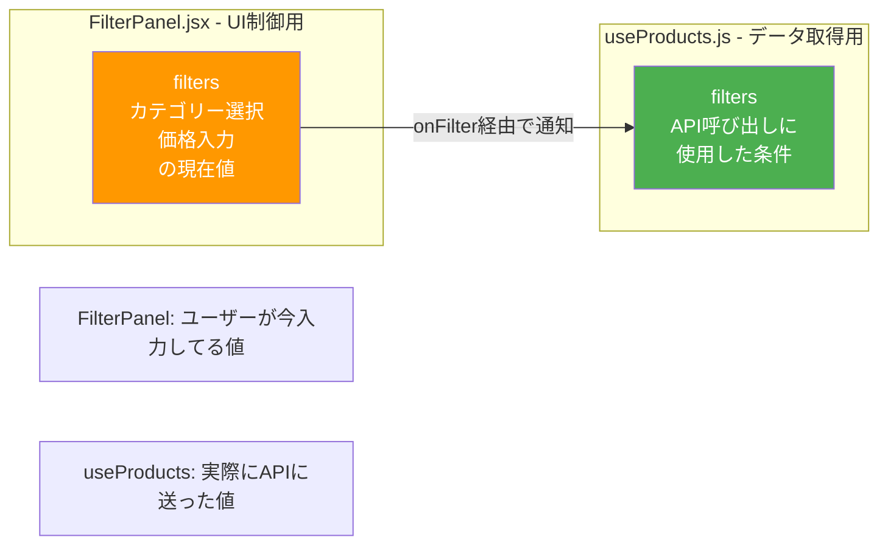

---

## 関数の定義場所マップ

### 🔧 状態を変更する関数の完全マップ

| 関数名 | 定義場所 | 引数 | 役割 | 変更する状態 | 呼び出し元 |
|--------|---------|------|------|------------|-----------|
| **fetchProducts** | `useProducts.js:17` | `newFilters: Object` | APIから製品取得 | products, loading, pagination, filters | useEffect, handleFilter, handlePageChange |
| **handleFilter** | `ProductList.jsx:16` | `filters: Object` | フィルター変更時の処理 | なし（fetchProductsを呼ぶ） | FilterPanel (onFilter経由) |
| **handlePageChange** | `ProductList.jsx:20` | `page: number` | ページ変更時の処理 | なし（fetchProductsを呼ぶ） | Pagination (onPageChange経由) |
| **handleFilterChange** | `FilterPanel.jsx:21` | `key: string, value: any` | フィルター入力時の処理 | filters (FilterPanel内) | select/input の onChange |

### 関数の呼び出しチェーン

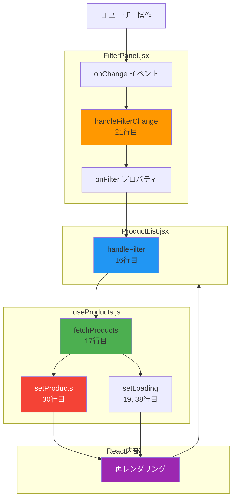

---

## ファイル構造とコードの位置

### 📁 プロジェクト構造と状態・関数の配置

```
frontend/src/
│
├── pages/
│   └── ProductList.jsx ................... 画面全体（親コンポーネント）
│       ├─ 11行目: const [searchParams] ... URLパラメータ
│       ├─ 12行目: const { products, ... } useProductsから受け取る
│       ├─ 16行目: const handleFilter ...... フィルター変更ハンドラ（子→親通信の受け口）
│       ├─ 20行目: const handlePageChange .. ページ変更ハンドラ
│       └─ 29行目: return ( ............... JSX（表示部分）
│           ├─ 35行目: <FilterPanel onFilter={handleFilter} />
│           └─ 47行目: {products.map(...)} 製品一覧表示
│
├── hooks/
│   └── useProducts.js .................... 製品データ管理ロジック
│       ├─ 5行目:  const [products, setProducts] = useState([])
│       ├─ 6行目:  const [loading, setLoading] = useState(true)
│       ├─ 7行目:  const [error, setError] = useState(null)
│       ├─ 8行目:  const [pagination, setPagination] = useState({...})
│       ├─ 14行目: const [filters, setFilters] = useState(initialFilters)
│       ├─ 17行目: const fetchProducts = async (newFilters) => { ... }
│       │   ├─ 19行目: setLoading(true)
│       │   ├─ 28行目: const response = await productsAPI.getList(...)
│       │   ├─ 30行目: setProducts(response.data)
│       │   └─ 38行目: setLoading(false)
│       ├─ 42行目: useEffect(() => { fetchProducts() }, [])
│       └─ 48行目: return { products, loading, error, pagination, filters, fetchProducts }
│
├── components/
│   ├── FilterPanel.jsx ................... フィルターUI
│   │   ├─ 5行目:  const [categories, setCategories] = useState([])
│   │   ├─ 6行目:  const [filters, setFilters] = useState({ ... })
│   │   ├─ 21行目: const handleFilterChange = (key, value) => {
│   │   │   ├─ 22行目: const newFilters = { ...filters, [key]: value }
│   │   │   ├─ 23行目: setFilters(newFilters) ... 自分の状態更新
│   │   │   └─ 24行目: onFilter(newFilters) .... 親に通知
│   │   ├─ 14行目: useEffect(() => { カテゴリー取得 }, [])
│   │   └─ 27行目: return ( <aside>...</aside> )
│   │
│   ├── ProductCard.jsx ................... 製品カード（状態なし）
│   │   └── propsで受け取った製品データを表示するだけ
│   │
│   └── Pagination.jsx .................... ページネーション（状態なし）
│       └── propsで受け取ったページ情報を表示するだけ
│
└── services/
    └── productsAPI.js .................... API通信（状態なし）
        └── httpClientを使ってバックエンドと通信
```

### コンポーネント階層と状態の流れ

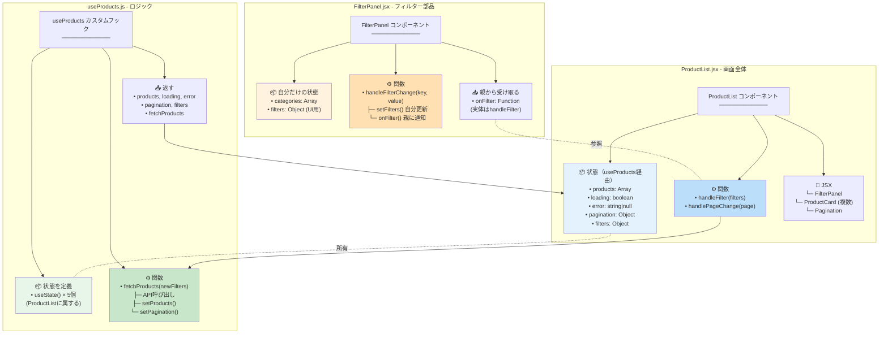

---

## 状態変更フロー

### パターン1: FilterPanelの状態 → ProductListの状態

**目的:** フィルター入力値を元に製品リストを更新したい

#### ステップバイステップ

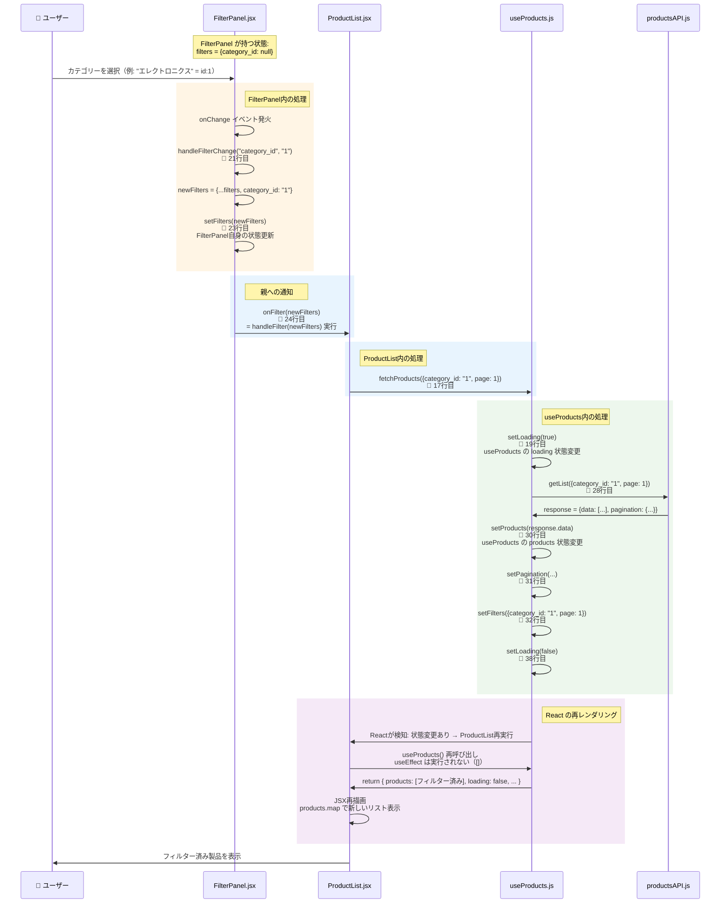

#### コード対応表

| ステップ | ファイル | 行番号 | コード | 説明 |
|---------|---------|-------|--------|------|
| 1 | FilterPanel.jsx | 36 | `<select onChange={(e) => handleFilterChange(...)}` | ユーザー操作 |
| 2 | FilterPanel.jsx | 21 | `const handleFilterChange = (key, value) => {` | イベントハンドラ実行 |
| 3 | FilterPanel.jsx | 23 | `setFilters(newFilters)` | FilterPanel自身の状態更新 |
| 4 | FilterPanel.jsx | 24 | `onFilter(newFilters)` | 親への通知（ProductListのhandleFilter実行） |
| 5 | ProductList.jsx | 16 | `const handleFilter = async (filters) => {` | 受け取った関数実行 |
| 6 | ProductList.jsx | 17 | `await fetchProducts({ ...filters, page: 1 })` | useProducts の関数呼び出し |
| 7 | useProducts.js | 19 | `setLoading(true)` | loading状態変更（ProductListの状態） |
| 8 | useProducts.js | 28 | `const response = await productsAPI.getList(...)` | API呼び出し |
| 9 | useProducts.js | 30 | `setProducts(response.data)` | products状態変更（ProductListの状態） |
| 10 | - | - | React内部 | ProductList再レンダリングトリガー |
| 11 | ProductList.jsx | 12 | `const { products, ... } = useProducts(...)` | useProducts再実行 |
| 12 | useProducts.js | 42 | `useEffect(() => {...}, [])` | 実行されない（[]なので） |
| 13 | useProducts.js | 48 | `return { products, loading, ... }` | 最新の状態を返す |
| 14 | ProductList.jsx | 47 | `{products.map((product) => ...)}` | 新しいproductsで再描画 |

### パターン2: 初回表示（自動実行）

**目的:** ページを開いた瞬間に全製品を表示したい

#### ステップバイステップ

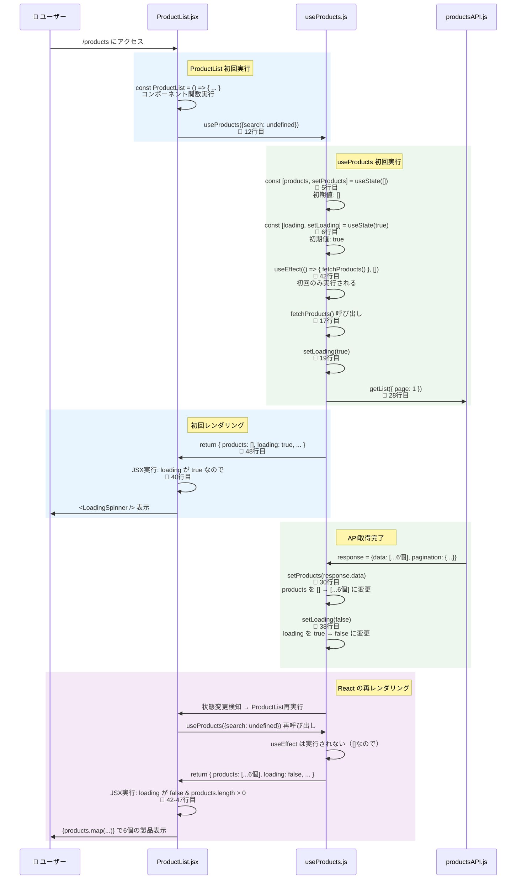

---

## データフロー図

### 状態の依存関係

```mermaid
graph TD
    subgraph "ユーザー入力"
        INPUT1[カテゴリー選択]
        INPUT2[価格入力]
        INPUT3[並び順選択]
    end
    
    subgraph "FilterPanel の状態"
        FP_FILTERS[filters<br/>{category_id, min_price, max_price, sort}]
    end
    
    subgraph "ProductList の状態 (useProducts経由)"
        UP_FILTERS[filters<br/>API送信済みの条件]
        UP_PRODUCTS[products<br/>表示する製品リスト]
        UP_LOADING[loading<br/>読み込み中フラグ]
        UP_PAGINATION[pagination<br/>ページ情報]
    end
    
    subgraph "表示"
        DISPLAY1[フィルターUI]
        DISPLAY2[製品カード × N]
        DISPLAY3[ページネーション]
    end
    
    INPUT1 --> FP_FILTERS
    INPUT2 --> FP_FILTERS
    INPUT3 --> FP_FILTERS
    
    FP_FILTERS -.onFilter経由.-> UP_FILTERS
    UP_FILTERS --> UP_PRODUCTS
    UP_PRODUCTS --> DISPLAY2
    UP_LOADING --> DISPLAY2
    UP_PAGINATION --> DISPLAY3
    FP_FILTERS --> DISPLAY1
    
    style FP_FILTERS fill:#ff9800,color:#fff
    style UP_FILTERS fill:#4caf50,color:#fff
    style UP_PRODUCTS fill:#2196f3,color:#fff
    style UP_LOADING fill:#9c27b0,color:#fff
    style DISPLAY2 fill:#f44336,color:#fff
```

---

## 実装パターン早見表

### よくあるケース別の実装方法

#### ケース1: コンポーネントAの状態をコンポーネントBに反映したい

**方法:** 状態を親に持たせて、両方の子にpropsで渡す

```javascript
// ❌ 悪い例: 兄弟コンポーネント間で直接通信できない
<ComponentA />  ❌→  <ComponentB />

// ✅ 良い例: 親を経由する
const Parent = () => {
  const [state, setState] = useState();
  
  return (
    <>
      <ComponentA onChange={setState} />  // 親に通知
      <ComponentB value={state} />        // 親から受け取る
    </>
  );
};
```

**本プロジェクトでの実装:**
- ComponentA = FilterPanel（フィルター入力）
- ComponentB = ProductCard（製品表示）
- Parent = ProductList（両方を管理）

#### ケース2: 複雑なロジックを持つ状態管理

**方法:** カスタムフックに切り出す

```javascript
// ❌ 悪い例: ProductList に全部書く（200行超える）
const ProductList = () => {
  const [products, setProducts] = useState([]);
  const [loading, setLoading] = useState(false);
  const [error, setError] = useState(null);
  const [pagination, setPagination] = useState({});
  
  const fetchProducts = async () => { /* 複雑な処理 */ };
  useEffect(() => { /* ... */ }, []);
  
  return ( /* 表示 */ );
};

// ✅ 良い例: カスタムフックで分離
const useProducts = () => {
  // 複雑なロジック
  return { products, loading, fetchProducts };
};

const ProductList = () => {
  const { products, loading, fetchProducts } = useProducts();
  return ( /* 表示だけに集中 */ );
};
```

#### ケース3: 初回のみ実行したい処理

**方法:** useEffect の依存配列を空にする

```javascript
// ✅ 初回のみ実行
useEffect(() => {
  fetchProducts();  // 1回だけ
}, []);

// ❌ 毎回実行（無限ループの危険）
useEffect(() => {
  fetchProducts();  // 再レンダリングのたびに実行 → setProducts → 再レンダリング → ...
});

// ✅ filters が変わったときだけ実行
useEffect(() => {
  fetchProducts();
}, [filters]);
```

#### ケース4: 子から親に通知したい

**方法:** コールバック関数を props で渡す

```javascript
// 親コンポーネント
const Parent = () => {
  const handleChange = (value) => {
    console.log('子から通知:', value);
  };
  
  return <Child onChange={handleChange} />;
};

// 子コンポーネント
const Child = ({ onChange }) => {
  return (
    <button onClick={() => onChange('新しい値')}>
      クリック
    </button>
  );
};
```

**本プロジェクトでの実装:**
```javascript
// ProductList.jsx
<FilterPanel onFilter={handleFilter} />  // onFilter という名前で渡す

// FilterPanel.jsx
const FilterPanel = ({ onFilter }) => {
  onFilter(newFilters);  // 親の handleFilter が実行される
};
```

---

## クイックリファレンス

### 「〇〇したい」→「どうすればいいか」

| やりたいこと | 確認する場所 | キーワード |
|------------|------------|-----------|
| フィルター条件を変えて製品を再取得したい | ProductList.jsx 16行目 | handleFilter |
| ページ番号を変えて製品を再取得したい | ProductList.jsx 20行目 | handlePageChange |
| 製品データがどこにあるか知りたい | useProducts.js 5行目 | const [products] |
| ローディング中かどうか知りたい | useProducts.js 6行目 | const [loading] |
| フィルターのUIの値を変えたい | FilterPanel.jsx 6行目 | const [filters] (FilterPanel内) |
| フィルターを親に通知したい | FilterPanel.jsx 24行目 | onFilter(newFilters) |
| 初回に自動で製品を取得したい | useProducts.js 42行目 | useEffect(() => {...}, []) |
| APIを呼び出したい | useProducts.js 17-40行目 | fetchProducts |

---

## トラブルシューティング

### よくある問題と解決方法

#### Q1: フィルターを変更しても製品が更新されない

**チェックリスト:**
1. FilterPanel で onFilter を呼んでいるか？（FilterPanel.jsx 24行目）
2. ProductList で onFilter={handleFilter} を渡しているか？（ProductList.jsx 35行目）
3. handleFilter で fetchProducts を呼んでいるか？（ProductList.jsx 17行目）
4. fetchProducts で setProducts を呼んでいるか？（useProducts.js 30行目）

#### Q2: ページを開くたびに製品が取得されない

**チェックリスト:**
1. useEffect の依存配列が [] になっているか？（useProducts.js 42行目）
2. useEffect の中で fetchProducts() を呼んでいるか？（useProducts.js 43行目）

#### Q3: 状態が更新されても画面が変わらない

**チェックリスト:**
1. setProducts など setState 関数を使っているか？（直接 products = ... はNG）
2. useProducts の return に products が含まれているか？（useProducts.js 48行目）
3. ProductList で useProducts() を呼んでいるか？（ProductList.jsx 12行目）

---

**作成日:** 2026年2月18日  
**対象:** React製品一覧ページのアーキテクチャ  
**バージョン:** 2.0 (完全版)

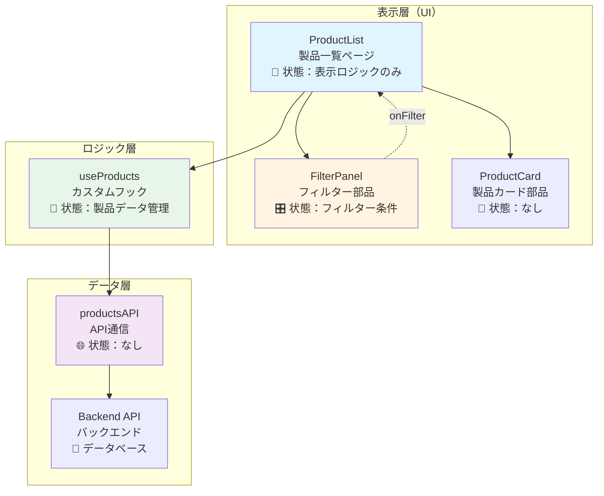

---

## コンポーネント間の状態管理

### 状態の所有権

```mermaid
graph LR
    subgraph "ProductList が持つ状態"
        PS[製品リスト<br/>products: []]
        LS[読み込み状態<br/>loading: true/false]
        ES[エラー状態<br/>error: null/string]
        PGS[ページ情報<br/>pagination: {}]
    end
    
    subgraph "FilterPanel が持つ状態"
        FS[フィルター条件<br/>filters: {<br/>category_id,<br/>min_price,<br/>max_price<br/>}]
    end
    
    subgraph "useProducts が実際に保持"
        UP[useState で定義<br/>↓<br/>ProductList に属する]
    end
    
    PS --> UP
    LS --> UP
    ES --> UP
    PGS --> UP
    
    style PS fill:#4caf50,color:#fff
    style LS fill:#4caf50,color:#fff
    style ES fill:#4caf50,color:#fff
    style PGS fill:#4caf50,color:#fff
    style FS fill:#ff9800,color:#fff
    style UP fill:#2196f3,color:#fff
```

### なぜこうするのか？

| 状態 | 所有者 | 理由 |
|------|--------|------|
| **製品リスト** | ProductList（useProducts経由） | 画面全体で表示する必要があるため |
| **フィルター条件** | FilterPanel | フィルターUIの表示制御のため |
| **読み込み状態** | ProductList（useProducts経由） | ローディング表示は画面全体に影響するため |

---

## データフロー

### 初回読み込みフロー

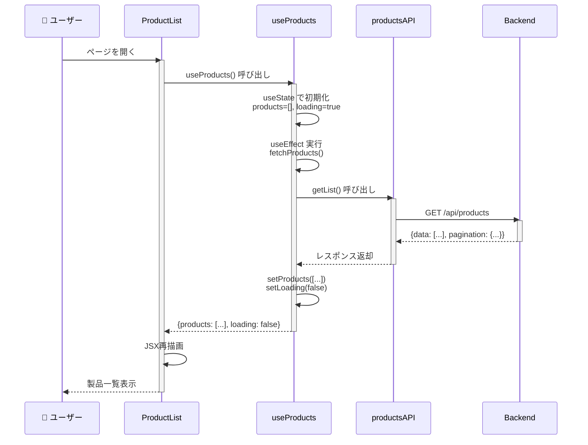

### フィルター変更フロー

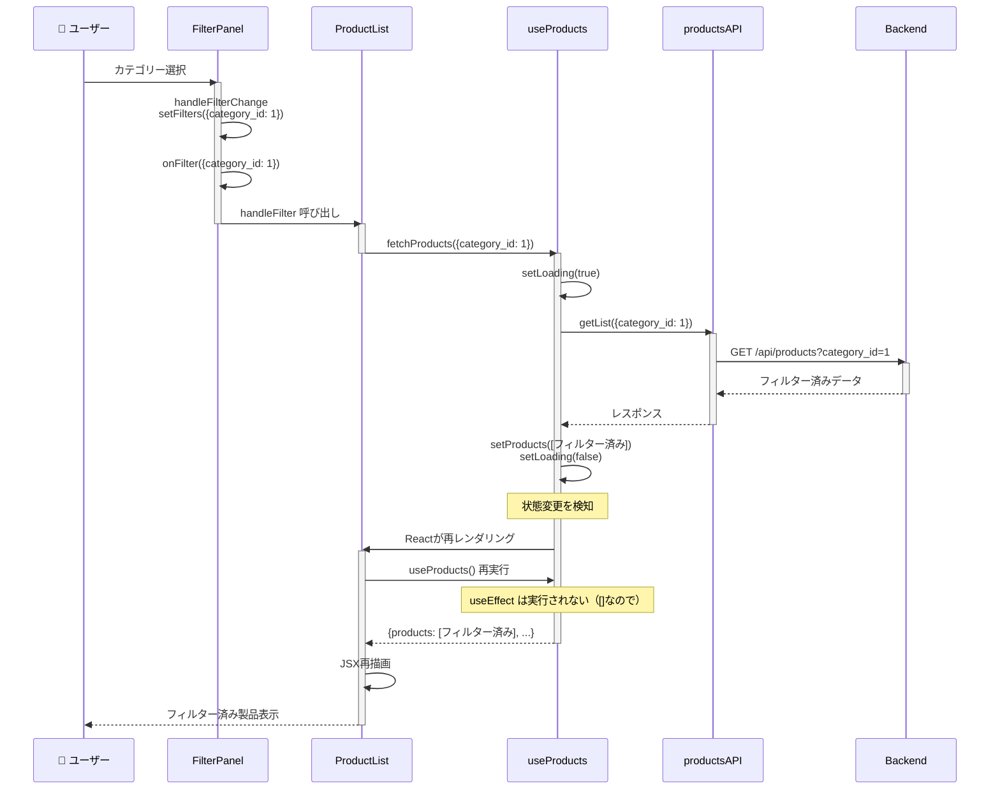

---

## なぜこの設計なのか？

### 問題：フィルター状態と製品状態は別の場所にある

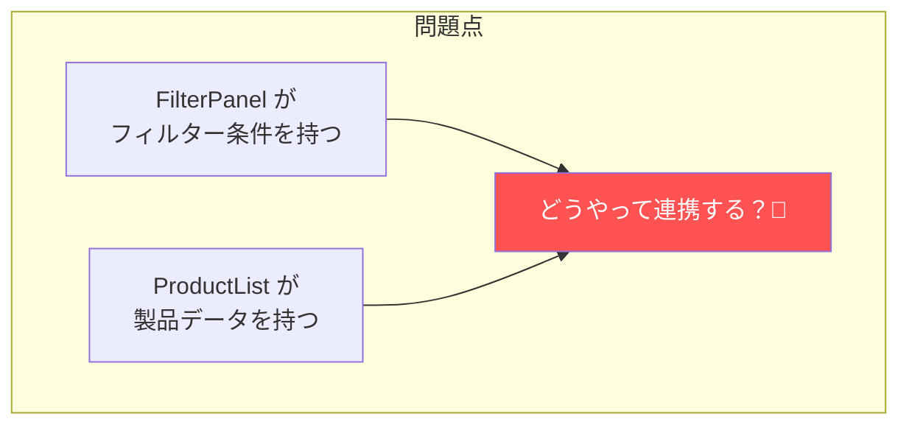

### 解決策1：状態を上に上げる（❌ 複雑）

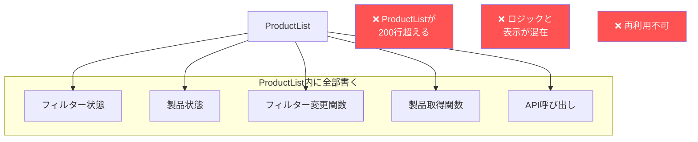

### 解決策2：カスタムフック（✅ シンプル）

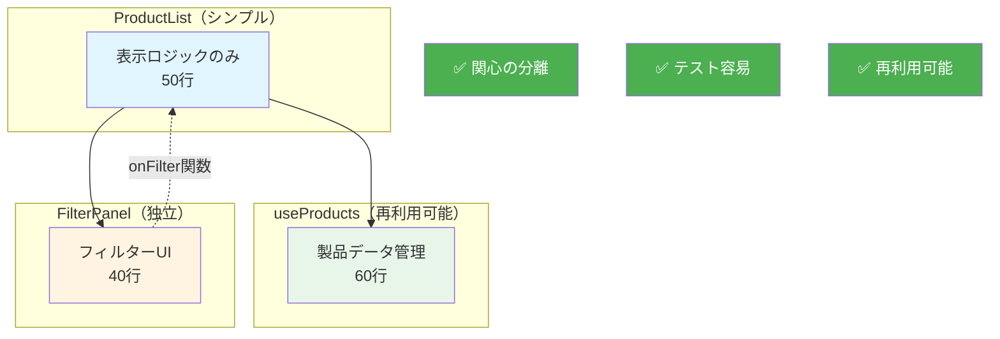

---

## 実行フロー詳細

### ProductList コンポーネントの実行

```mermaid
graph TD
    Start[ProductList 実行開始]
    
    Start --> A[useProducts を呼び出し]
    A --> B{初回レンダリング？}
    
    B -->|Yes| C[useProducts 初回実行]
    B -->|No| D[useProducts 再実行]
    
    C --> C1[useState 初期化<br/>products=[], loading=true]
    C --> C2[fetchProducts 関数定義]
    C --> C3[useEffect 実行<br/>fetchProducts 呼び出し]
    C --> C4[return 初期値]
    
    D --> D1[useState から最新値取得<br/>products=[...], loading=false]
    D --> D2[fetchProducts 関数再定義]
    D --> D3[useEffect 実行しない<br/>[] なので]
    D --> D4[return 最新値]
    
    C4 --> E[handleFilter 関数定義]
    D4 --> E
    
    E --> F[JSX 描画]
    F --> End[画面表示]
    
    style C3 fill:#4caf50,color:#fff
    style D3 fill:#ff9800,color:#fff
```

### 状態変更時の再レンダリング

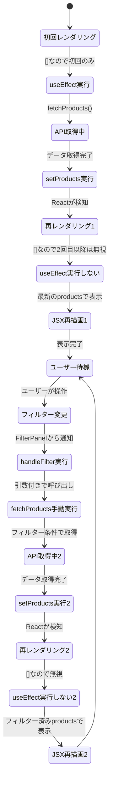

---

## コードレベルの対応表

### ProductList.jsx

```javascript
const ProductList = () => {
  // 🔵 useProducts から状態を受け取る
  const { products, loading, error, pagination, fetchProducts } = useProducts({
    search: searchParams.get("search") || undefined,
  });

  // 🟢 フィルター変更ハンドラ（FilterPanel に渡す関数）
  const handleFilter = async (filters) => {
    await fetchProducts({ ...filters, page: 1 });
  };

  return (
    <div>
      {/* 🟡 FilterPanel にハンドラを渡す */}
      <FilterPanel onFilter={handleFilter} />
      
      {/* 🔴 製品一覧を表示 */}
      {products.map((product) => (
        <ProductCard key={product.id} product={product} />
      ))}
    </div>
  );
};
```

### useProducts.js（カスタムフック）

```javascript
const useProducts = (initialFilters = {}) => {
  // 🔵 状態を定義（ProductListに属する）
  const [products, setProducts] = useState([]);
  const [loading, setLoading] = useState(true);

  // 🟢 製品取得関数を定義
  const fetchProducts = async (newFilters = {}) => {
    setLoading(true);
    const response = await productsAPI.getList(mergedFilters);
    setProducts(response.data);  // ← 状態変更 = 再レンダリングトリガー
    setLoading(false);
  };

  // 🟡 初回のみ実行（[] = 依存なし）
  useEffect(() => {
    fetchProducts();
  }, []);

  // 🔴 状態と関数を返す（ProductListで使える）
  return { products, loading, fetchProducts };
};
```

### FilterPanel.jsx

```javascript
const FilterPanel = ({ onFilter }) => {
  // 🔵 フィルター条件の状態（自分だけが使う）
  const [filters, setFilters] = useState({
    category_id: null,
    min_price: null,
  });

  // 🟢 フィルター変更時
  const handleFilterChange = (key, value) => {
    const newFilters = { ...filters, [key]: value };
    setFilters(newFilters);  // 自分の状態を更新
    onFilter(newFilters);    // 親（ProductList）に通知
  };

  return (
    <select onChange={(e) => handleFilterChange("category_id", e.target.value)}>
      <option value="">すべて</option>
    </select>
  );
};
```

---

## まとめ：設計の原則

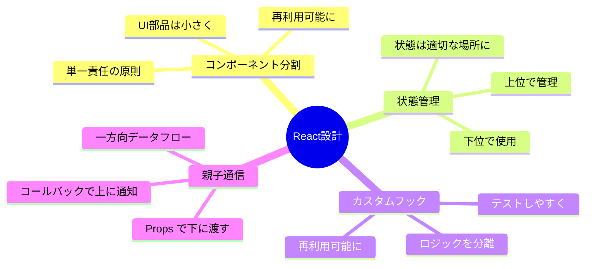

### 3つの重要ルール

| ルール | 説明 | 例 |
|--------|------|-----|
| **1. 単一責任** | 1つのコンポーネントは1つの仕事 | FilterPanel はフィルターUIのみ |
| **2. 関心の分離** | 表示とロジックを分ける | useProducts でロジック分離 |
| **3. データは下る、イベントは上る** | Props で下、callback で上 | onFilter で親に通知 |

---

## よくある質問

### Q1: なぜ useState は useProducts 内にあるのに ProductList の状態なの？

**A:** useProducts は ProductList **の中で** 呼ばれているから。Reactはフックが「どのコンポーネントから呼ばれたか」を記録している。

```javascript
// ProductList の実行コンテキスト内
const ProductList = () => {
  const { products } = useProducts();  // ← ProductListの状態として登録
};
```

### Q2: useEffect の [] はなぜ必要？

**A:** []（空の依存配列）がないと、毎回 fetchProducts が実行されて無限ループになる。

```javascript
useEffect(() => {
  fetchProducts();  // setProducts を呼ぶ
  // → 再レンダリング
  // → useEffect 再実行
  // → fetchProducts 再度実行
  // → 無限ループ！
});

// 解決策：
useEffect(() => {
  fetchProducts();
}, []);  // ← 初回のみ実行
```

### Q3: onFilter は戻り値がないのになぜ必要？

**A:** 目的は「戻り値」ではなく「親への通知」。onFilter を呼ぶことで親の handleFilter が実行される。

```javascript
// FilterPanel
onFilter(newFilters);  // 親に「変更があった」と通知

// ProductList
<FilterPanel onFilter={handleFilter} />
// onFilter が呼ばれる = handleFilter が実行される
```

---

## 最終チェックリスト

この設計により以下が実現できる：

- ✅ フィルター変更時に製品リストが更新される
- ✅ コンポーネントがシンプルで理解しやすい
- ✅ useProducts を他のページでも再利用できる
- ✅ 各コンポーネントのテストが容易
- ✅ 状態の流れが追いやすい

---

**作成日:** 2026年2月18日  
**対象:** React製品一覧ページのアーキテクチャ
